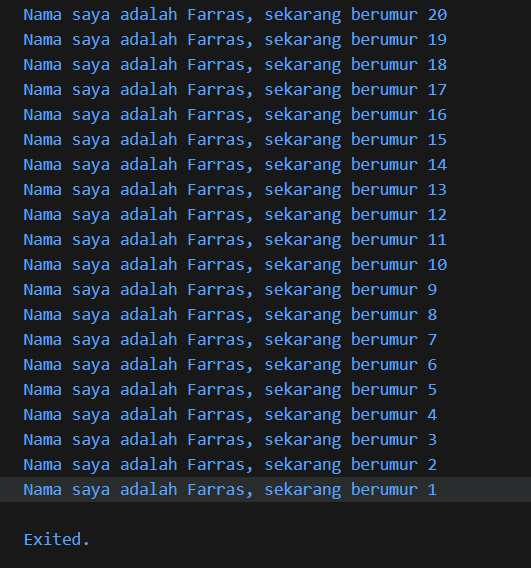

# Laporan Praktikum 02 : Pengantar Bahasa Pemrograman Dart - Bagian 1

Nama  : Muhammad Farras Awaludin Alwi  
NIM   : 244107060032  
Absen : 12  

---

## Soal 1

**Pertanyaan:**  
Modifikasilah kode pada baris 3 di VS Code atau Editor Code favorit Anda berikut ini agar mendapatkan keluaran (output) sesuai yang diminta!

**Output Modifikasi Kode:**  

---

## Soal 2

**Pertanyaan:**  
Mengapa sangat penting untuk memahami bahasa pemrograman Dart sebelum kita menggunakan framework Flutter ? Jelaskan!

**Jawaban:**  
Memahami Dart itu penting sebelum memakai Flutter karena Flutter dibangun dan dijalankan menggunakan Dart, jadi kalau kita sudah paham dasar-dasar Dart seperti cara menulis variabel, fungsi, dan logika program, kita akan lebih mudah membuat aplikasi di Flutter, lebih cepat memahami konsep seperti widget dan state, serta lebih gampang menghindari dan memperbaiki error saat coding.

---

## Soal 3

**Pertanyaan:**  
Rangkumlah materi dari codelab ini menjadi poin-poin penting yang dapat Anda gunakan untuk membantu proses pengembangan aplikasi mobile menggunakan framework Flutter.

**Jawaban:**  
Materi ini menjelaskan bahwa Dart adalah bahasa inti yang digunakan Flutter, sehingga memahami Dart menjadi dasar penting sebelum belajar Flutter. Dart dirancang sebagai bahasa modern dengan tooling yang bagus, garbage collection, type safety, dan bisa berjalan lintas platform melalui Dart VM maupun dikompilasi ke JavaScript, serta mendukung mode JIT (untuk pengembangan dan hot reload) dan AOT (untuk performa tinggi saat rilis). Selain itu, Dart memiliki struktur sintaks yang mirip bahasa populer lain, mendukung OOP, dan menyediakan berbagai operator dasar. Untuk praktik, kita bisa memakai DartPad atau menjalankan file Dart secara lokal, dan setiap program Dart selalu dimulai dari fungsi main() sebagai titik awal eksekusi kode.

---

## Soal 4

**Pertanyaan:**  
Buatlah penjelasan dan contoh eksekusi kode tentang perbedaan Null Safety dan Late variabel !

**Jawaban:**  
Null Safety adalah fitur Dart yang mencegah kita “tidak sengaja” menyimpan nilai null ke variabel, jadi kalau variabel bertipe String maka wajib berisi teks dan tidak boleh null, sedangkan kalau mau boleh null harus ditulis String?; contoh eksekusinya: String nama = 'Budi'; print(nama.length); aman, tapi String? nama2; print(nama2?.length); tetap aman karena pakai ?. saat nilainya bisa null. Sementara itu, late dipakai saat kita yakin variabel pasti akan diisi nanti sebelum dipakai, jadi kita boleh menunda pengisian tanpa membuatnya nullable; contoh: late String token; token = 'ABC123'; print(token); akan berhasil, tetapi kalau langsung print(token); sebelum diisi, program akan error saat runtime karena variabel late belum diinisialisasi.