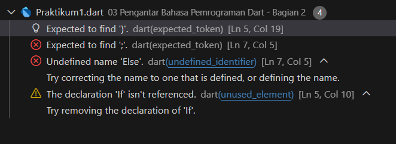
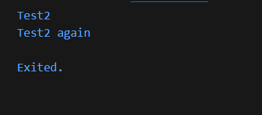
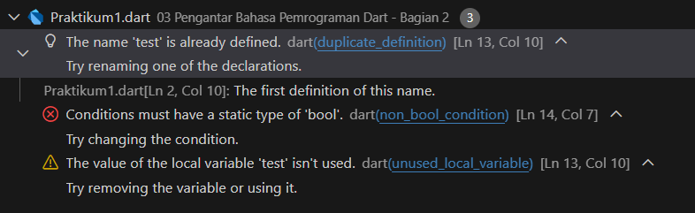
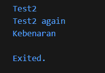
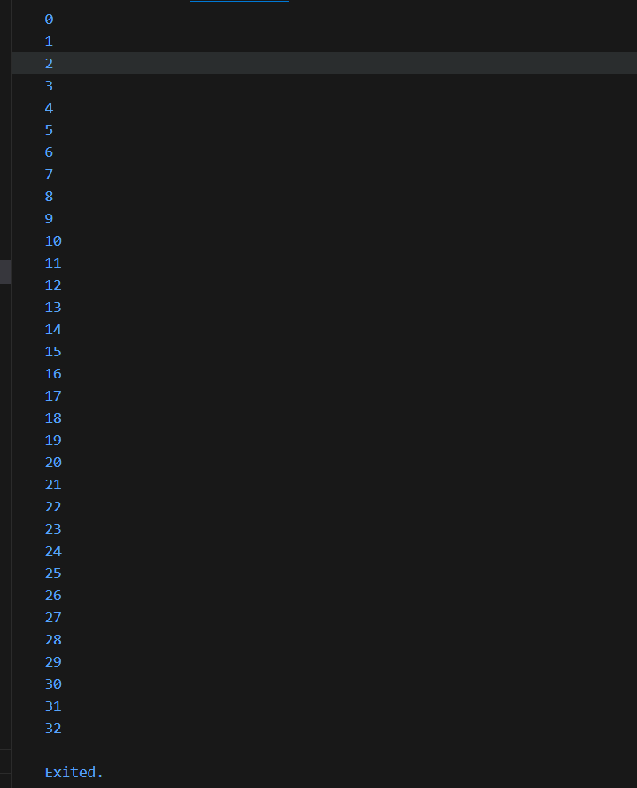
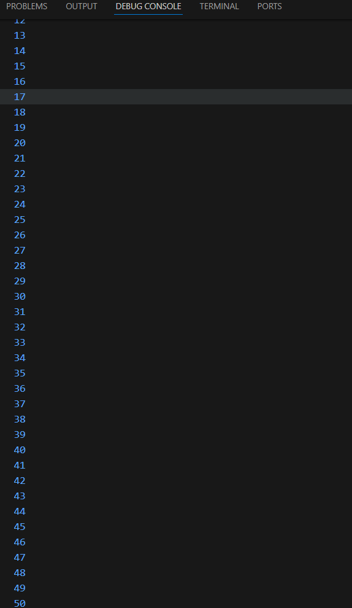

# Laporan Praktikum 03 : Pengantar Bahasa Pemrograman Dart - Bagian 2

Nama  : Muhammad Farras Awaludin Alwi  
NIM   : 244107060032  
Absen : 12  

---

## Praktikum 1 : Menerapkan Control Flows ("if/else")

**Langkah 1**  
Ketik atau salin kode program berikut ke dalam fungsi `main()`.

```dart
void main() {
  String test = "test2";
  if (test == "test1") {
    print("Test1");
  } else If (test == "test2") {
    print("Test2");
  } Else {
    print("Something else");
  }

  if (test == "test2") print("Test2 again");
}
```

**Langkah 2**
Silakan coba eksekusi (Run) kode pada langkah 1 tersebut. Apa yang terjadi? Jelaskan!



Kode di Langkah 1 error dan tidak bisa dijalankan, karena penulisan keyword-nya salah: di Dart harus else if dan else huruf kecil.

perbaikan kode langkah 1:

```dart
void main() {
  String test = "test2";
  if (test == "test1") {
    print("Test1");
  } else if (test == "test2") {
    print("Test2");
  } else {
    print("Something else");
  }

  if (test == "test2") print("Test2 again");
}
```

Output kode



**Langkah 3**
Tambahkan kode program berikut, lalu coba eksekusi (Run) kode Anda.

```dart
String test = "true";
if (test) {
   print("Kebenaran");
}
```

Apa yang terjadi ? Jika terjadi error, silakan perbaiki namun tetap menggunakan if/else.



setelah ditambakan, Kode ini juga error, karena if (test) di Dart wajib bertipe boolean (bool), sedangkan test disini adalah String ("true"). Dart tidak melakukan type coercion seperti JavaScript (string "true" tidak otomatis dianggap benar).

perbaikan kode langkah 3

```dart
String test2 = "true";
if (test2 == "true") {
   print("Kebenaran");
}
```

Output Kode




## Praktikum 2 : Menerapkan Perulangan "while" dan "do-while"

**Langkah 1**
Ketik atau salin kode program berikut ke dalam fungsi main().

```dart
while (counter < 33) {
  print(counter);
  counter++;
}
```

**Langkah 2**
Silakan coba eksekusi (Run) kode pada langkah 1 tersebut. Apa yang terjadi? Jelaskan! Lalu perbaiki jika terjadi error.


Kode terjadi error, penyebabnya adalah variabel counter belum dideklarasikan, sehingga perlu ditambahkan int counter = 0; sebelum perulangan.

Perbaikan kode langkah 1:

```dart
void main() {
  int counter = 0;
  while (counter < 33) {
    print(counter);
    counter++;
  }
}
```

Output Kode




**Langkah 3**
Tambahkan kode program berikut, lalu coba eksekusi (Run) kode Anda.

```dart
do {
  print(counter);
  counter++;
} while (counter < 77);
```

Apa yang terjadi ? Jika terjadi error, silakan perbaiki namun tetap menggunakan do-while.


Saat dijalankan, setelah selesai mencetak 0 sampai 32 dari while, program akan melanjutkan do-while dan mencetak angka dari 33 sampai 76, karena do-while selalu menjalankan blok minimal sekali lalu mengecek kondisi counter < 77.

Output Kode



---

