# Laporan Praktikum 04 : Pengantar Bahasa Pemrograman Dart - Bagian 3

Nama  : Muhammad Farras Awaludin Alwi  
NIM   : 244107060032  
Absen : 12  

---

## Praktikum 1 : Eksperimen Tipe Data List

**Langkah 1**
Ketik atau salin kode program berikut ke dalam void main().

```dart
void main() {
  var list = [1, 2, 3];
  assert(list.length == 3);
  assert(list[1] == 2);
  print(list.length);
  print(list[1]);

  list[1] = 1;
  assert(list[1] == 1);
  print(list[1]);
}
```

**Langkah 2**
Silakan coba eksekusi (Run) kode pada langkah 1 tersebut. Apa yang terjadi? Jelaskan!

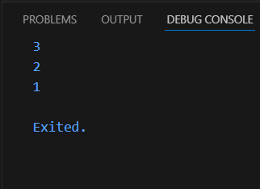

Saat dijalankan, program akan mencetak 3, lalu 2, lalu 1. Ini terjadi karena list awal berisi tiga elemen sehingga length bernilai 3, elemen index ke-1 awalnya bernilai 2, kemudian elemen index ke-1 diubah menjadi 1 sehingga nilai yang dicetak terakhir adalah 1.

**Langkah 3**
Ubah kode pada langkah 1 menjadi variabel final yang mempunyai index = 5 dengan default value = null. Isilah nama dan NIM Anda pada elemen index ke-1 dan ke-2. Lalu print dan capture hasilnya.

Apa yang terjadi ? Jika terjadi error, silakan perbaiki.

Kode :
```dart
void main() {
  final List<String?> list = List.filled(5, null);
  assert(list.length == 5);
  assert(list[1] == null);
  print(list.length);
  print(list[1]);

  list[1] = 'Muhammad Farras Awaludin Alwi';
  list[2] = '244107060032';
  assert(list[1] == 'Muhammad Farras Awaludin Alwi');
  assert(list[2] == '244107060032');
  print(list[1]);
  print(list[2]);
}
```

Ouput :

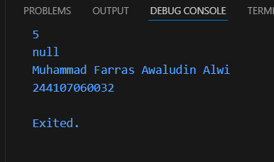

Hasilnya list akan berisi 5 elemen dengan nilai awal null, lalu pada index ke-1 terisi nama dan index ke-2 terisi NIM.

## Praktikum 1 : Eksperimen Tipe Data Set

**Langkah 1**
Ketik atau salin kode program berikut ke dalam fungsi main().

```dart
void main() {
  var halogens = {'fluorine', 'chlorine', 'bromine', 'iodine', 'astatine'};
  print(halogens);
}
```

**Langkah 2**
Silakan coba eksekusi (Run) kode pada langkah 1 tersebut. Apa yang terjadi? Jelaskan! Lalu perbaiki jika terjadi error.

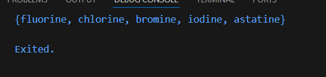

Saat dijalankan, program akan menampilkan semua elemen halogens dalam bentuk Set.

**Langkah 3**
Tambahkan kode program berikut, lalu coba eksekusi (Run) kode Anda.

```dart
var names1 = <String>{};
Set<String> names2 = {}; // This works, too.
var names3 = {}; // Creates a map, not a set.

print(names1);
print(names2);
print(names3);
```

Apa yang terjadi ? Jika terjadi error, silakan perbaiki namun tetap menggunakan ketiga variabel tersebut. Tambahkan elemen nama dan NIM Anda pada kedua variabel Set tersebut dengan dua fungsi berbeda yaitu .add() dan .addAll(). Untuk variabel Map dihapus, nanti kita coba di praktikum selanjutnya.

Kode : 
```dart
void main() {
  var names1 = <String>{};
  Set<String> names2 = {};

  names1.add('Muhammad Farras Awaludin');
  names1.add('244107060032');

  names2.addAll(['Muhammad Farras Awaludin', '244107060032']);

  print("ini names1");
  print(names1);
  print("ini names2");
  print(names2);
}
```

Yang terjadi adalah names1 dan names2 akan tercetak sebagai Set dan berisi nama serta NIM (tanpa duplikat). Jika names3 = {} tidak dihapus, maka names3 akan menjadi Map kosong, bukan Set, karena {} tanpa tipe akan dianggap Map di Dart.

Dokumentasikan code dan hasil di console, lalu buat laporannya.

## Praktikum 3 : EEksperimen Tipe Data Maps

**Langkah 1**
Ketik atau salin kode program berikut ke dalam fungsi main().

```dart
var gifts = {
  // Key:    Value
  'first': 'partridge',
  'second': 'turtledoves',
  'fifth': 1
};

var nobleGases = {
  2: 'helium',
  10: 'neon',
  18: 2,
};

print(gifts);
print(nobleGases);
```

**Langkah 2**
Silakan coba eksekusi (Run) kode pada langkah 1 tersebut. Apa yang terjadi? Jelaskan! Lalu perbaiki jika terjadi error.

Output :

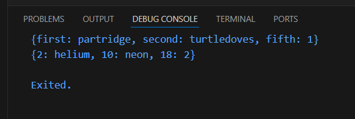

Saat dijalankan, program akan menampilkan isi gifts dan nobleGases dalam bentuk Map (pasangan key-value). Kode tetap bisa jalan, tetapi tipe datanya menjadi campuran (dynamic) karena ada value bertipe int di dalam Map yang lain value-nya String (contoh: 'fifth': 1 dan 18: 2).

**Langkah 3**
Tambahkan kode program berikut, lalu coba eksekusi (Run) kode Anda.

```dart
var mhs1 = Map<String, String>();
gifts['first'] = 'partridge';
gifts['second'] = 'turtledoves';
gifts['fifth'] = 'golden rings';

var mhs2 = Map<int, String>();
nobleGases[2] = 'helium';
nobleGases[10] = 'neon';
nobleGases[18] = 'argon';
```

Apa yang terjadi ? Jika terjadi error, silakan perbaiki.

Tambahkan elemen nama dan NIM Anda pada tiap variabel di atas (gifts, nobleGases, mhs1, dan mhs2). Dokumentasikan hasilnya dan buat laporannya!

kode :

```dart
void main() {
  var gifts = {
    // Key:    Value
    'first': 'partridge',
    'second': 'turtledoves',
    'fifth': 1,
    'nama': 'Dimas Adit Thalia Putra',
    'nim': '244107060037',
  };

  var nobleGases = {
    2: 'helium',
    10: 'neon',
    18: 'argon',
    'nama': 'Dimas Adit Thalia Putra',
    'nim': '244107060037',
  };

  gifts['first'] = 'partridge';
  gifts['second'] = 'turtledoves';
  gifts['fifth'] = 'golden rings';

  nobleGases[2] = 'helium';
  nobleGases[10] = 'neon';
  nobleGases[18] = 'argon';

  var mhs1 = Map<String, String>();
  mhs1['nama'] = "Dimas Adit Thalia Putra";
  mhs1['nim'] = "244107060037";

  var mhs2 = Map<int, String>();
  mhs2[1] = "Dimas Adit Thalia Putra";
  mhs2[2] = "244107060037";

  print("ini variabel gifts");
  print(gifts);
  print("ini variabel nobleGases");
  print(nobleGases);
  print("ini variabel mhs1");
  print(mhs1);
  print("ini variabel mhs2");
  print(mhs2);
}
```

Output :

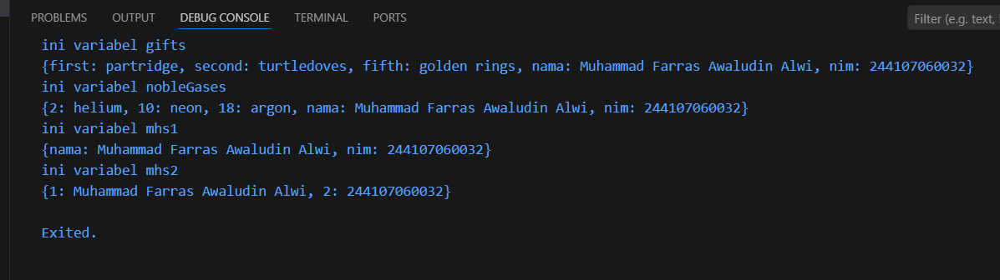


## Praktikum 4 : Eksperimen Tipe Data List: Spread dan Control-flow Operators

**Langkah 1**
Ketik atau salin kode program berikut ke dalam fungsi main().
```dart
var list = [1, 2, 3];
var list2 = [0, ...list];
print(list1);
print(list2);
print(list2.length);
```
**Langkah 2**
Silakan coba eksekusi (Run) kode pada langkah 1 tersebut. Apa yang terjadi? Jelaskan! Lalu perbaiki jika terjadi error.

terjadi error :

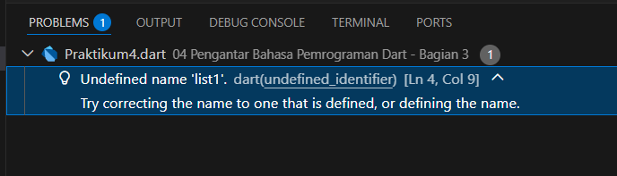

perbaikan dengan print list1 dengan list yang sudah di deklarasikan

Output :
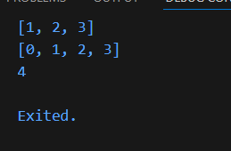

Kode awal akan error karena list1 belum dideklarasikan, sehingga perlu dibuat terlebih dahulu. Setelah diperbaiki, program mencetak isi list1, isi list2 yang merupakan gabungan [0] dan isi list, lalu mencetak panjang list2 yaitu 4.

**Langkah 3**
Tambahkan kode program berikut, lalu coba eksekusi (Run) kode Anda.
```dart
list1 = [1, 2, null];
print(list1);
var list3 = [0, ...?list1];
print(list3.length);
```
Apa yang terjadi ? Jika terjadi error, silakan perbaiki.

Tambahkan variabel list berisi NIM Anda menggunakan Spread Operators. Dokumentasikan hasilnya dan buat laporannya!

Kode :

```dart
void main() {
  var list = [1, 2, 3];
  var list2 = [0, ...list];
  print(list);
  print(list2);
  print(list2.length);

  var list1 = [1, 2, null];
  print(list1);
  var list3 = [0, ...?list1];
  print(list3.length);

  var charNIM = [2, 4, 4, 1, 0, 7, 0, 6, 0, 0, 3, 7];
  var nim = [...charNIM];
  print(nim);
}
```

Output :

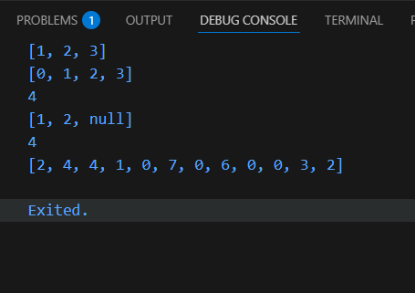

**Langkah 4**
Tambahkan kode program berikut, lalu coba eksekusi (Run) kode Anda.
```dart
var nav = ['Home', 'Furniture', 'Plants', if (promoActive) 'Outlet'];
print(nav);
```
Apa yang terjadi ? Jika terjadi error, silakan perbaiki. Tunjukkan hasilnya jika variabel promoActive ketika true dan false.

terjadi error :

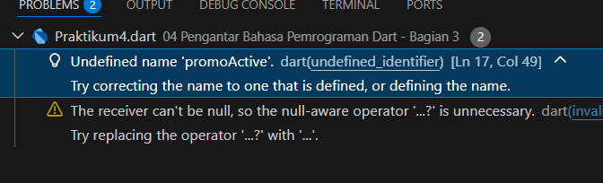

error karena promoactive belum dideklarasikan

output setelah deklarasi promoactive menggunakan true dan false

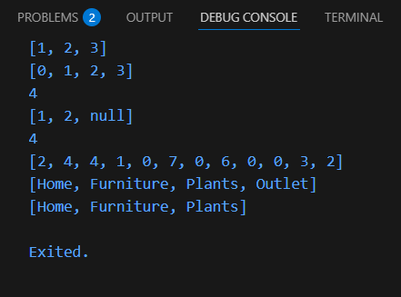

Saat promoActive bernilai true, elemen Outlet ikut masuk ke list. Saat false, elemen Outlet tidak dimasukkan.

**Langkah 5**
Tambahkan kode program berikut, lalu coba eksekusi (Run) kode Anda.
```dart
var nav2 = ['Home', 'Furniture', 'Plants', if (login case 'Manager') 'Inventory'];
print(nav2);
```
Apa yang terjadi ? Jika terjadi error, silakan perbaiki. Tunjukkan hasilnya jika variabel login mempunyai kondisi lain.

terjadi error karena login belum di deklarasikan
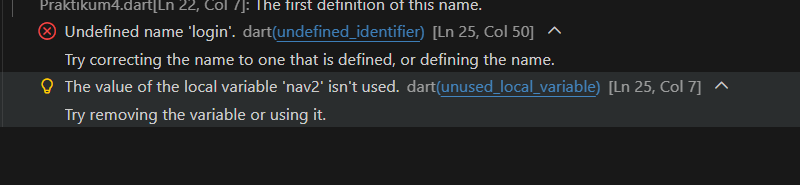

setelah perbaikan :

output :

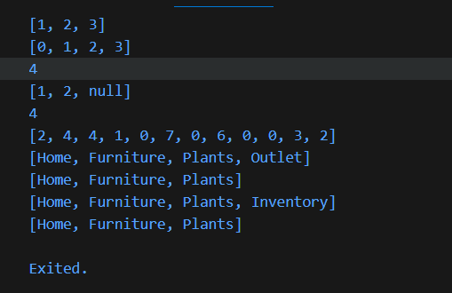
Saat login adalah 'Manager', maka Inventory ditambahkan. Jika login kondisi lain (misal 'Staff'), Inventory tidak ditambahkan.


**Langkah 6**
Tambahkan kode program berikut, lalu coba eksekusi (Run) kode Anda.
```dart
var listOfInts = [1, 2, 3];
var listOfStrings = ['#0', for (var i in listOfInts) '#$i'];
assert(listOfStrings[1] == '#1');
print(listOfStrings);
```
Apa yang terjadi ? Jika terjadi error, silakan perbaiki. Jelaskan manfaat Collection For dan dokumentasikan hasilnya.

ouput :

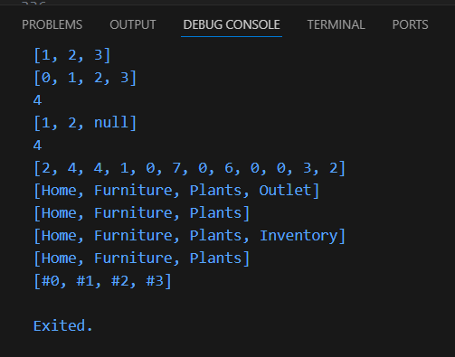

Program menghasilkan list baru ['#0', '#1', '#2', '#3']. Manfaat Collection For adalah memudahkan membuat list secara dinamis dari data lain tanpa perlu menulis perulangan terpisah dan add() satu per satu, sehingga kode lebih ringkas dan mudah dibaca.

## Praktikum 5 : Eksperimen Tipe Data Records

**Langkah 1**
Ketik atau salin kode program berikut ke dalam fungsi main().
```dart
var record = ('first', a: 2, b: true, 'last');
print(record)
```

**Langkah 2**
Silakan coba eksekusi (Run) kode pada langkah 1 tersebut. Apa yang terjadi? Jelaskan! Lalu perbaiki jika terjadi error.

Output :
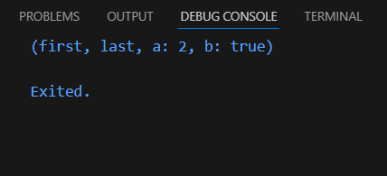
Saat dijalankan, program menampilkan isi record yang berisi gabungan positional field ('first', 'last') dan named field (a: 2, b: true). Terjadi error karen tidak memberikan titik koma setelah print reocord

**Langkah 3**
Tambahkan kode program berikut di luar scope void main(), lalu coba eksekusi (Run) kode Anda.
```dart
(int, int) tukar((int, int) record) {
  var (a, b) = record;
  return (b, a);
}
```
Apa yang terjadi ? Jika terjadi error, silakan perbaiki. Gunakan fungsi tukar() di dalam main() sehingga tampak jelas proses pertukaran value field di dalam Records.

Kode :
```dart
(int, int) tukar((int, int) record) {
  var (a, b) = record;
  return (b, a);
}
void main() {
  var record = ('first', a: 2, b: true, 'last');
  print(record);

  var hasil = tukar((1, 2));
  print(hasil);
}
```

output :
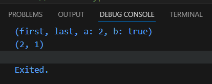

fungsi tukar() mengambil record (a, b), lalu mengembalikan (b, a) sehingga nilainya tertukar.

**Langkah 4**
Tambahkan kode program berikut di dalam scope void main(), lalu coba eksekusi (Run) kode Anda.

```dart
// Record type annotation in a variable declaration:
(String, int) mahasiswa;
print(mahasiswa);
```

Apa yang terjadi ? Jika terjadi error, silakan perbaiki. Inisialisasi field nama dan NIM Anda pada variabel record mahasiswa di atas. Dokumentasikan hasilnya dan buat laporannya!

output : 

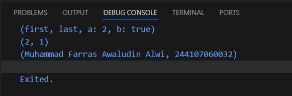

jika mahasiswa diprint sebelum diisi, akan error karena variabel lokal belum diinisialisasi. Setelah diinisialisasi, record akan tercetak berisi nama dan NIM.

**Langkah 5**
Tambahkan kode program berikut di dalam scope void main(), lalu coba eksekusi (Run) kode Anda.

```dart
var mahasiswa2 = ('first', a: 2, b: true, 'last');

print(mahasiswa2.$1); // Prints 'first'
print(mahasiswa2.a); // Prints 2
print(mahasiswa2.b); // Prints true
print(mahasiswa2.$2); // Prints 'last'
```
Apa yang terjadi ? Jika terjadi error, silakan perbaiki. Gantilah salah satu isi record dengan nama dan NIM Anda, lalu dokumentasikan hasilnya dan buat laporannya!

## Tugas Praktikum


