# hello_world1

A new Flutter project.

# Laporan Praktikum 05 : Aplikasi Pertama dan Widget Dasar Flutter

Nama  : Muhammad Farras Awaludin Alwi  
NIM   : 244107060032  
Absen : 12  

---

## Praktikum 3 : Membuat Repository GitHub dan Laporan Praktikum
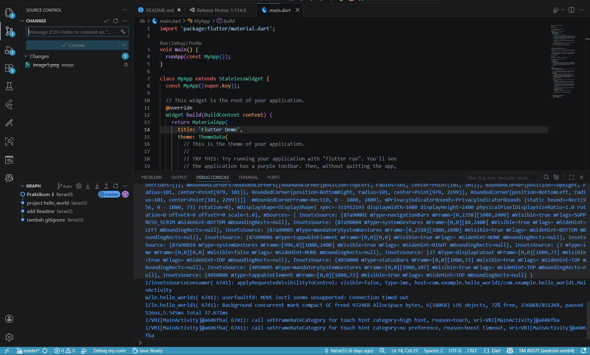

## Praktikum 4: Menerapkan Widget Dasar

**Langkah 1 : Text Widget**
-
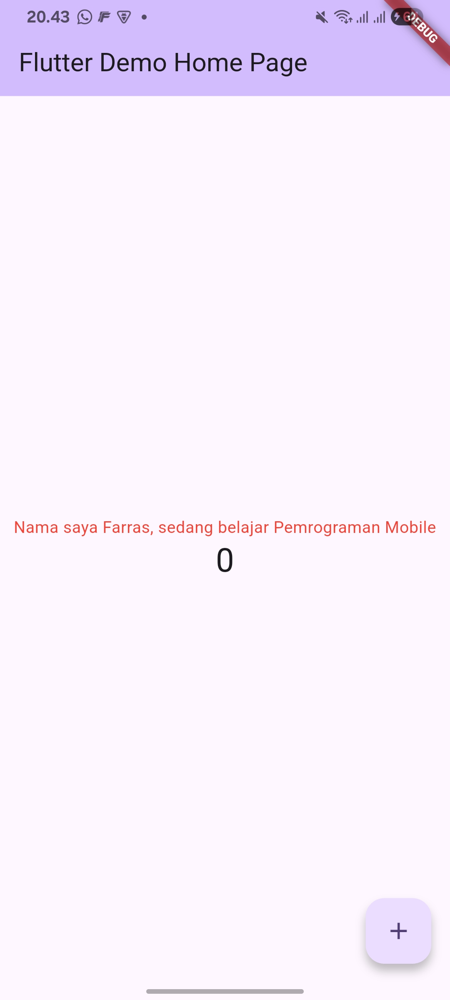

**Langkah 2: Image Widget**
-
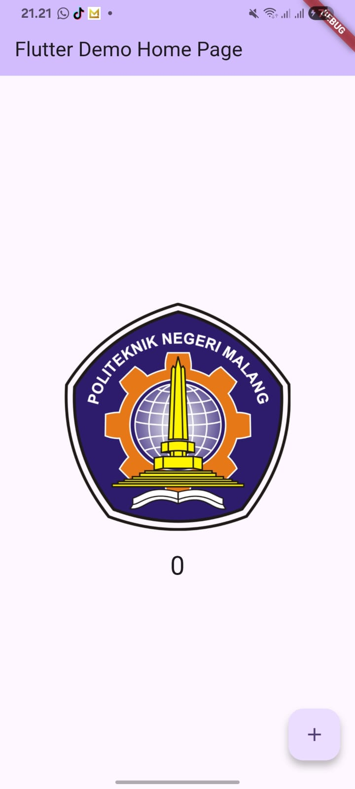

## Praktikum 5: Menerapkan Widget Material Design dan iOS Cupertino

**Langkah 1 : Cupertino Button dan Loading Bar**
-
**Langkah 2 : Floating Action Button (FAB)**
-
**Langkah 3 : Scaffold Widget**
-
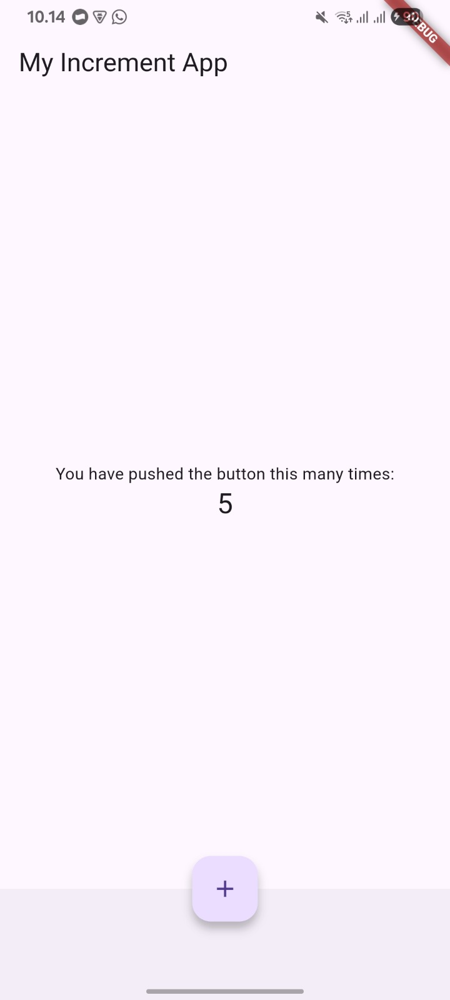

**Langkah 4 : Dialog Widget**
-
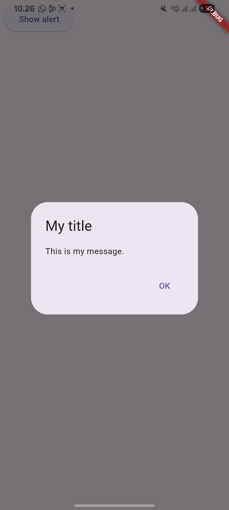

**Langkah 5 : Input dan Selection Widget**
-
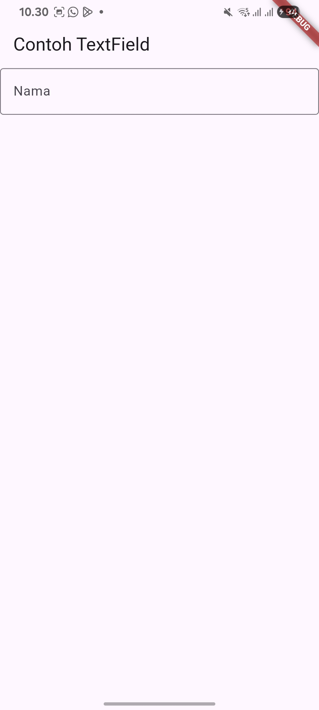

**Langkah 6: Date and Time Pickers**
-
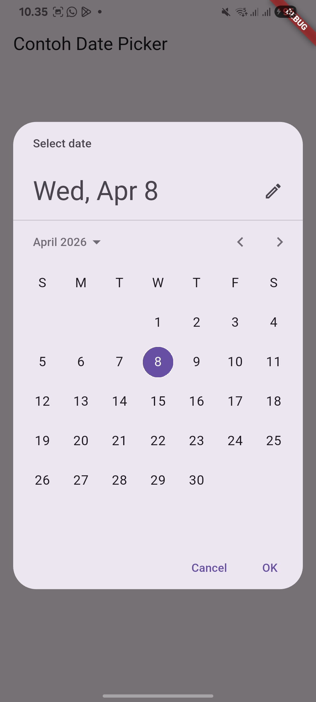

## Tugas Praktikum

1. Selesaikan Praktikum 1 sampai 5, lalu dokumentasikan dan push ke repository Anda berupa screenshot setiap hasil pekerjaan beserta penjelasannya di file README.md!
2. Selesaikan Praktikum 2 dan Anda wajib menjalankan aplikasi hello_world pada perangkat fisik (device Android/iOS) agar Anda mempunyai pengalaman untuk menghubungkan ke perangkat fisik. Capture hasil aplikasi di perangkat, lalu buatlah laporan praktikum pada file README.md.
3. Pada praktikum 5 mulai dari Langkah 3 sampai 6, buatlah file widget tersendiri di folder basic_widgets, kemudian pada file main.dart cukup melakukan import widget sesuai masing-masing langkah tersebut!
4. Selesaikan Codelabs: Your first Flutter app, lalu buatlah laporan praktikumnya dan push ke repository GitHub Anda!
5. README.md berisi: capture hasil akhir tiap praktikum (side-by-side, bisa juga berupa file GIF agar terlihat proses perubahan ketika ada aksi dari pengguna) dengan menampilkan NIM dan Nama Anda sebagai ciri pekerjaan Anda.
6. Kumpulkan berupa link repository/commit GitHub Anda kepada dosen yang telah disepakati!

**4**
-

A. tampilan awal
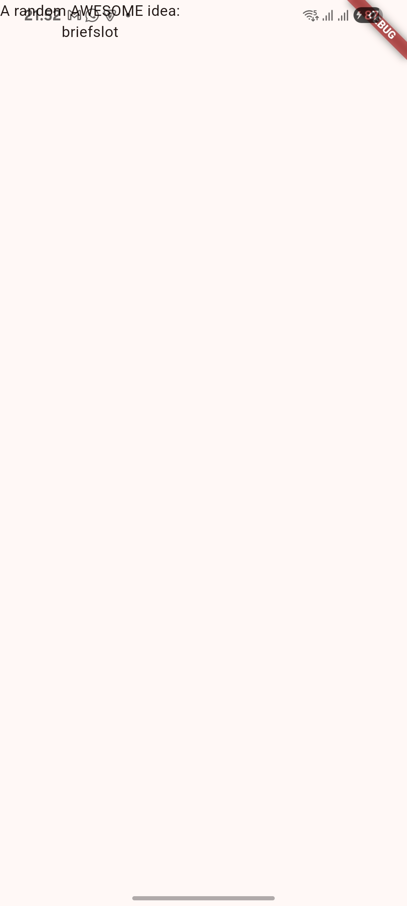

B. tambah tombol

C. isi tombol next dengan kata random
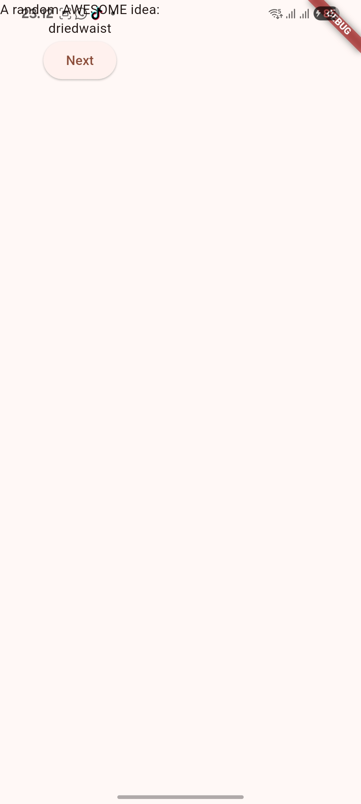

D. text padding
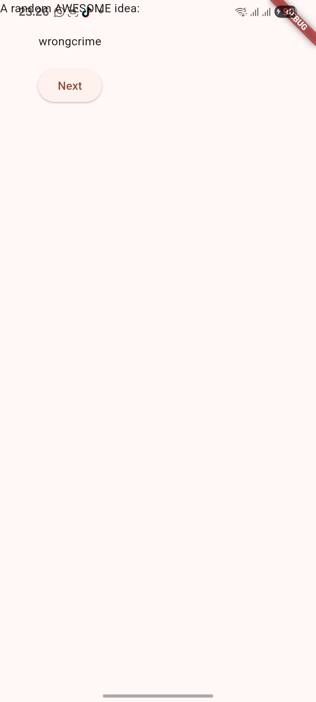

E. Menggabungkan widget padding dan text dengan widget card
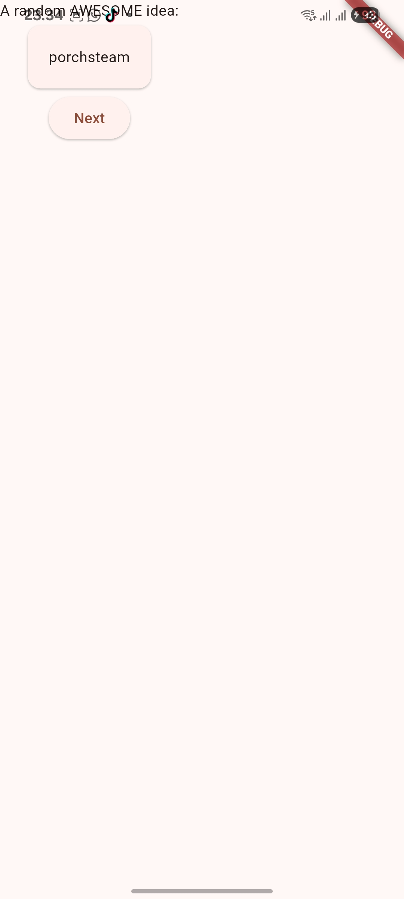

F. menambahkan tema dan gaya
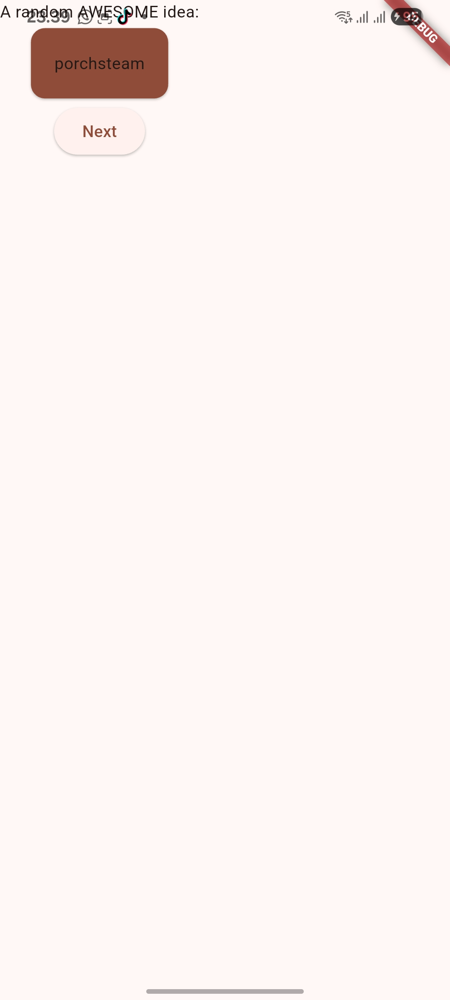

G. Menambahkan Themtext
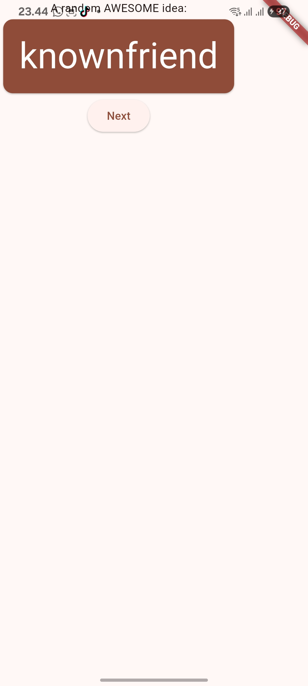

H. Menempatkan UI ditengah
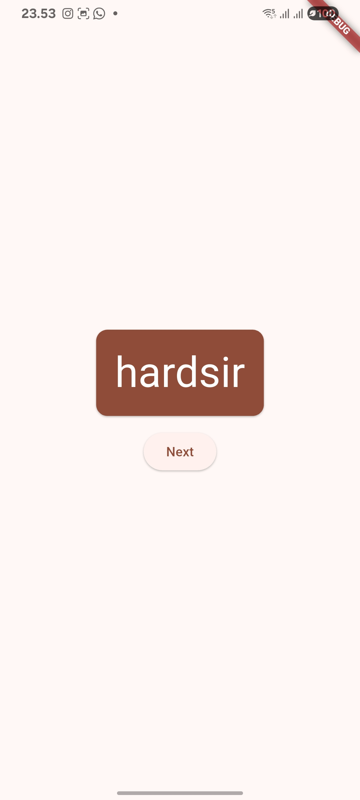

I. Menambahkan tombol dan fungsi like
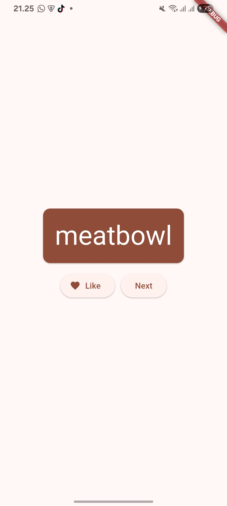

J. Menambahkan kolom navigasi
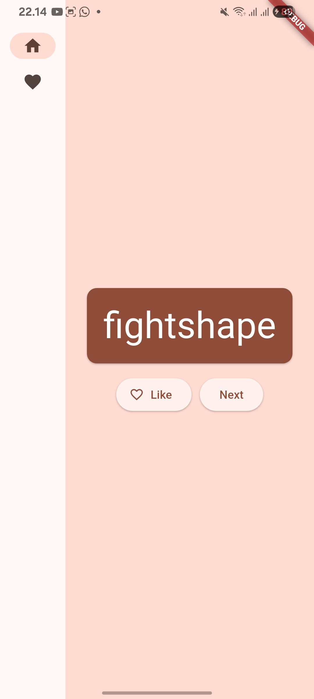

K. Menambahkan halaman baru
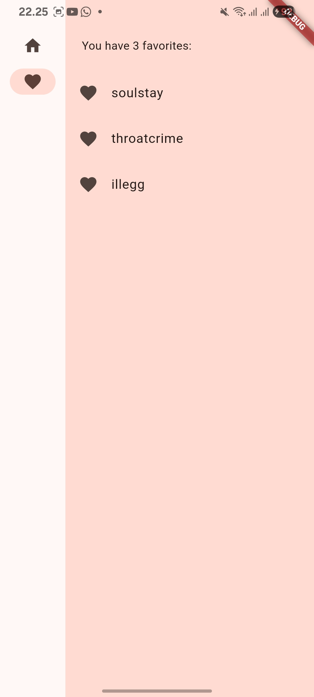