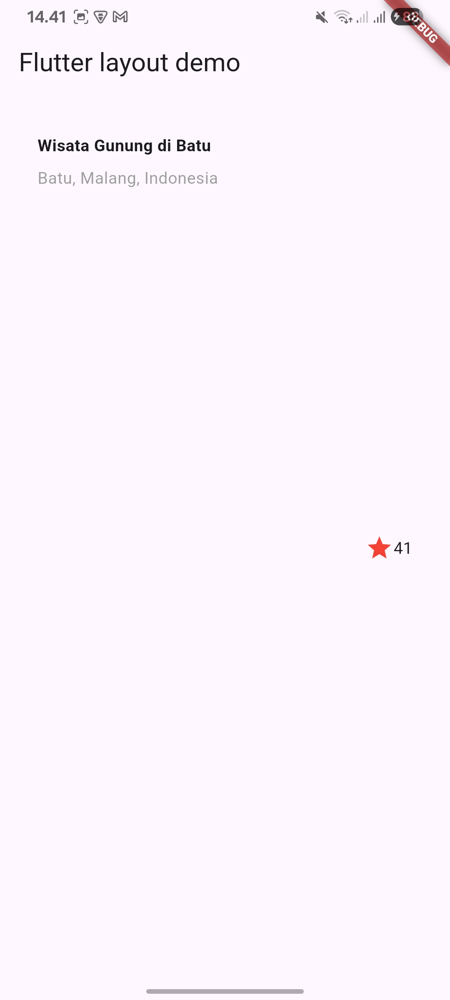
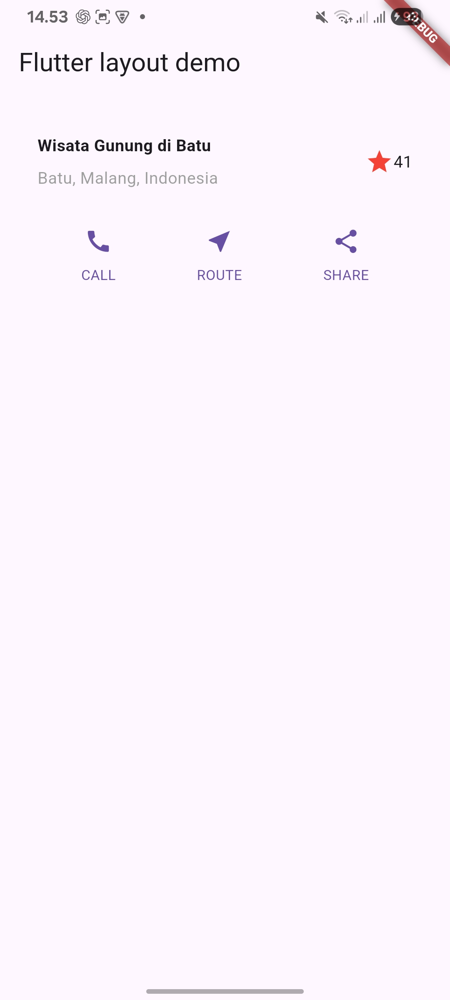
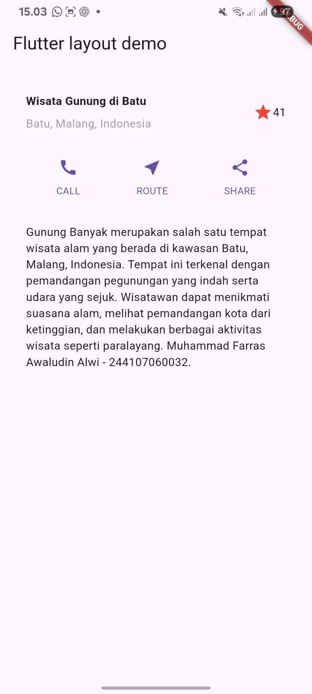
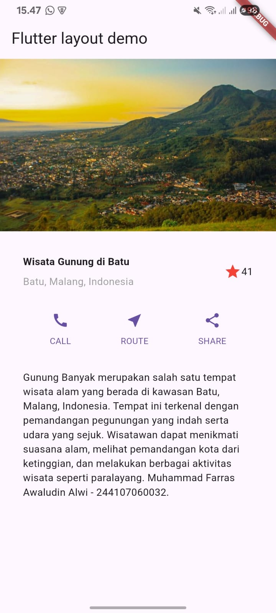
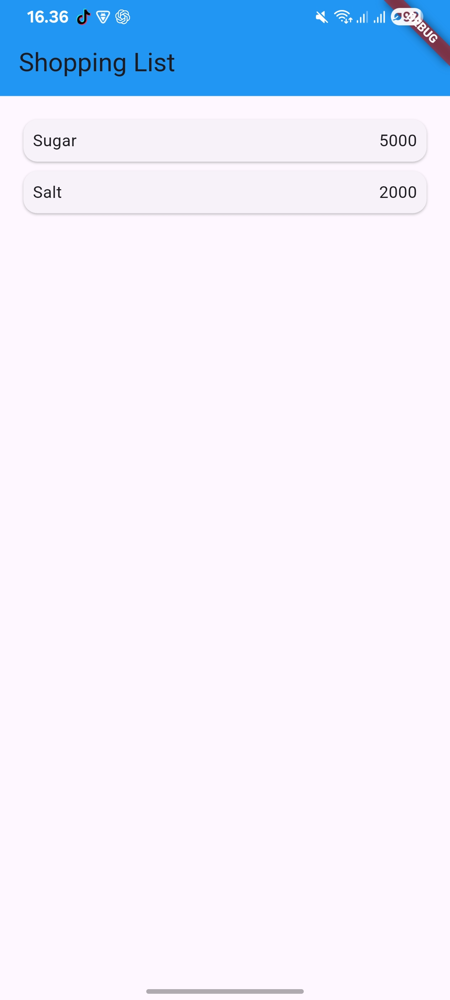
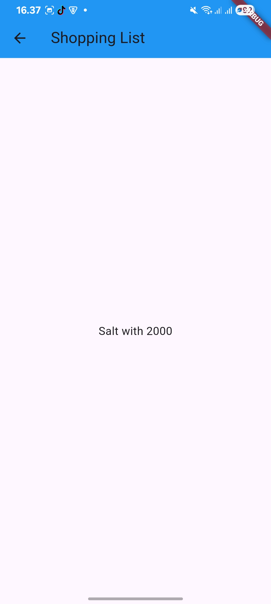
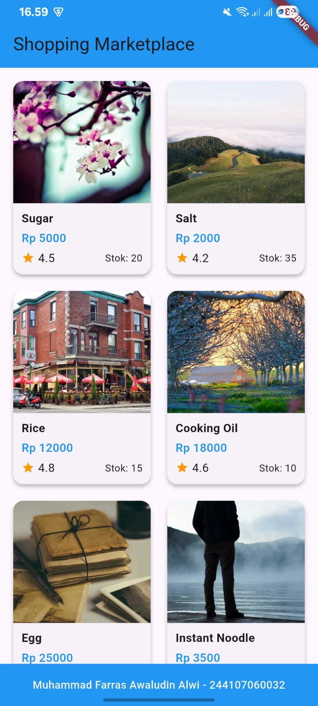
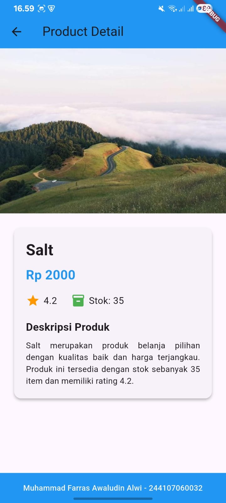

# Laporan Praktikum 06 : Layout dan Navigasi

Nama  : Muhammad Farras Awaludin Alwi  
NIM   : 244107060032  
Absen : 12  

---

## Praktikum 1 : Membangun Layout di Flutter

**Langkah 1**  
Buatlah sebuah project Flutter baru dengan nama `layout_flutter`.

```bash
flutter create layout_flutter
```

Setelah project berhasil dibuat, buka project tersebut menggunakan Visual Studio Code.

```bash
cd layout_flutter
code .
```

Pada langkah ini, project Flutter baru berhasil dibuat. Project ini nantinya digunakan untuk membuat tampilan layout sederhana menggunakan Flutter.

---

**Langkah 2**  
Buka file `lib/main.dart`, lalu ganti isi kodenya dengan kode berikut. Isi bagian title menggunakan nama dan NIM.

```dart
import 'package:flutter/material.dart';

void main() => runApp(const MyApp());

class MyApp extends StatelessWidget {
  const MyApp({super.key});

  @override
  Widget build(BuildContext context) {
    return MaterialApp(
      title: 'Flutter layout: Muhammad Farras Awaludin Alwi - 244107060032',
      home: Scaffold(
        appBar: AppBar(
          title: const Text('Flutter layout demo'),
        ),
        body: const Center(
          child: Text('Hello World'),
        ),
      ),
    );
  }
}
```

Setelah kode dijalankan, aplikasi menampilkan AppBar dengan judul `Flutter layout demo` dan teks `Hello World` di bagian tengah layar.

---

**Langkah 3**  
Identifikasi layout diagram dari tampilan akhir yang akan dibuat.

Pada langkah ini, layout dipecah menjadi beberapa bagian utama, yaitu gambar, bagian judul, bagian tombol, dan bagian teks. Pada Praktikum 1 ini, bagian yang dibuat terlebih dahulu adalah bagian judul atau `title section`.

Bagian `title section` terdiri dari nama tempat wisata, lokasi tempat wisata, ikon bintang, dan angka rating.

Struktur layout bagian judul menggunakan widget `Row`. Di dalam `Row`, terdapat widget `Expanded` yang membungkus `Column`. Widget `Column` digunakan untuk menyusun dua teks secara vertikal, yaitu nama tempat wisata dan lokasi tempat wisata. Sedangkan ikon bintang dan angka rating diletakkan di sebelah kanan.

Dengan struktur tersebut, teks akan berada di sebelah kiri, sedangkan ikon bintang dan angka rating berada di sebelah kanan.

---

**Langkah 4**  
Implementasikan bagian `title row` dengan menambahkan variabel `titleSection` di bagian atas method `build()` pada class `MyApp`.

```dart
Widget titleSection = Container(
  padding: const EdgeInsets.all(32),
  child: Row(
    children: [
      Expanded(
        child: Column(
          crossAxisAlignment: CrossAxisAlignment.start,
          children: [
            Container(
              padding: const EdgeInsets.only(bottom: 8),
              child: const Text(
                'Wisata Gunung di Batu',
                style: TextStyle(
                  fontWeight: FontWeight.bold,
                ),
              ),
            ),
            Text(
              'Batu, Malang, Indonesia',
              style: TextStyle(
                color: Colors.grey[500],
              ),
            ),
          ],
        ),
      ),
      const Icon(
        Icons.star,
        color: Colors.red,
      ),
      const Text('41'),
    ],
  ),
);
```

Pada kode tersebut, widget `Column` diletakkan di dalam widget `Expanded` agar dapat menyesuaikan ruang kosong yang tersedia di dalam widget `Row`.

Properti `crossAxisAlignment: CrossAxisAlignment.start` digunakan agar isi teks pada `Column` berada di posisi awal atau rata kiri.

Teks `Wisata Gunung di Batu` diletakkan di dalam widget `Container` agar dapat diberi padding bawah sebesar 8. Teks tersebut diberi style tebal menggunakan `FontWeight.bold`.

Teks `Batu, Malang, Indonesia` diberi warna abu-abu menggunakan `Colors.grey[500]`.

Pada bagian kanan ditambahkan ikon bintang menggunakan `Icons.star` dengan warna merah, kemudian ditambahkan teks `41` sebagai angka rating.

Kemudian ubah bagian `body` yang sebelumnya berisi teks `Hello World` menjadi variabel `titleSection`.

```dart
body: titleSection,
```

Kode lengkap setelah diperbaiki adalah sebagai berikut:

```dart
import 'package:flutter/material.dart';

void main() => runApp(const MyApp());

class MyApp extends StatelessWidget {
  const MyApp({super.key});

  @override
  Widget build(BuildContext context) {
    Widget titleSection = Container(
      padding: const EdgeInsets.all(32),
      child: Row(
        children: [
          Expanded(
            child: Column(
              crossAxisAlignment: CrossAxisAlignment.start,
              children: [
                Container(
                  padding: const EdgeInsets.only(bottom: 8),
                  child: const Text(
                    'Wisata Gunung di Batu',
                    style: TextStyle(
                      fontWeight: FontWeight.bold,
                    ),
                  ),
                ),
                Text(
                  'Batu, Malang, Indonesia',
                  style: TextStyle(
                    color: Colors.grey[500],
                  ),
                ),
              ],
            ),
          ),
          const Icon(
            Icons.star,
            color: Colors.red,
          ),
          const Text('41'),
        ],
      ),
    );

    return MaterialApp(
      title: 'Flutter layout: Muhammad Farras Awaludin Alwi - 244107060032',
      home: Scaffold(
        appBar: AppBar(
          title: const Text('Flutter layout demo'),
        ),
        body: titleSection,
      ),
    );
  }
}
```

Output kode:



Setelah dijalankan, aplikasi menampilkan bagian judul yang berisi teks `Wisata Gunung di Batu`, lokasi `Batu, Malang, Indonesia`, ikon bintang berwarna merah, dan angka rating `41`.

Dengan demikian, Praktikum 1 berhasil membuat bagian `title section` pada layout Flutter menggunakan widget `Container`, `Row`, `Column`, `Expanded`, `Icon`, dan `Text`.

---


## Praktikum 2 : Implementasi Button Row

**Langkah 1**  
Buat method `_buildButtonColumn` di dalam class `MyApp`.

Method ini digunakan untuk membuat kolom tombol yang berisi ikon dan teks. Method ini memiliki tiga parameter, yaitu `color`, `icon`, dan `label`.

```dart
Column _buildButtonColumn(Color color, IconData icon, String label) {
  return Column(
    mainAxisSize: MainAxisSize.min,
    mainAxisAlignment: MainAxisAlignment.center,
    children: [
      Icon(icon, color: color),
      Container(
        margin: const EdgeInsets.only(top: 8),
        child: Text(
          label,
          style: TextStyle(
            fontSize: 12,
            fontWeight: FontWeight.w400,
            color: color,
          ),
        ),
      ),
    ],
  );
}
```

Method `_buildButtonColumn` digunakan agar kode pembuatan tombol tidak ditulis berulang-ulang. Setiap tombol memiliki bentuk yang sama, yaitu ikon di bagian atas dan teks di bagian bawah.

Pada method tersebut, widget `Column` digunakan untuk menyusun ikon dan teks secara vertikal. Properti `mainAxisSize: MainAxisSize.min` digunakan agar ukuran kolom menyesuaikan isi widget di dalamnya.

Widget `Icon` digunakan untuk menampilkan ikon sesuai parameter yang dikirimkan. Sedangkan widget `Text` digunakan untuk menampilkan label tombol. Teks dibungkus menggunakan `Container` agar dapat diberi margin bagian atas sebesar 8 piksel, sehingga jarak antara ikon dan teks tidak terlalu dekat.

---

**Langkah 2**  
Buat widget `buttonSection` di bawah deklarasi `titleSection` pada method `build()`.

```dart
Color color = Theme.of(context).primaryColor;

Widget buttonSection = Row(
  mainAxisAlignment: MainAxisAlignment.spaceEvenly,
  children: [
    _buildButtonColumn(color, Icons.call, 'CALL'),
    _buildButtonColumn(color, Icons.near_me, 'ROUTE'),
    _buildButtonColumn(color, Icons.share, 'SHARE'),
  ],
);
```

Pada kode tersebut, variabel `color` digunakan untuk mengambil warna utama dari tema aplikasi menggunakan `Theme.of(context).primaryColor`.

Widget `buttonSection` dibuat menggunakan widget `Row`, karena tombol akan disusun secara horizontal. Di dalam `Row`, terdapat tiga tombol, yaitu `CALL`, `ROUTE`, dan `SHARE`.

Setiap tombol dibuat dengan memanggil method `_buildButtonColumn`. Method tersebut menerima warna, ikon, dan teks label sebagai parameter.

Properti `mainAxisAlignment: MainAxisAlignment.spaceEvenly` digunakan agar jarak antar tombol tersusun secara merata di sepanjang baris.

---

**Langkah 3**  
Tambahkan variabel `buttonSection` ke dalam `body`.

Sebelumnya, bagian `body` hanya menampilkan `titleSection`.

```dart
body: titleSection,
```

Kemudian diubah menjadi menggunakan widget `Column`, agar `titleSection` dan `buttonSection` dapat disusun secara vertikal.

```dart
body: Column(
  children: [
    titleSection,
    buttonSection,
  ],
),
```

Kode lengkap setelah menambahkan `buttonSection` adalah sebagai berikut:

```dart
import 'package:flutter/material.dart';

void main() => runApp(const MyApp());

class MyApp extends StatelessWidget {
  const MyApp({super.key});

  @override
  Widget build(BuildContext context) {
    Widget titleSection = Container(
      padding: const EdgeInsets.all(32),
      child: Row(
        children: [
          Expanded(
            child: Column(
              crossAxisAlignment: CrossAxisAlignment.start,
              children: [
                Container(
                  padding: const EdgeInsets.only(bottom: 8),
                  child: const Text(
                    'Wisata Gunung di Batu',
                    style: TextStyle(
                      fontWeight: FontWeight.bold,
                    ),
                  ),
                ),
                Text(
                  'Batu, Malang, Indonesia',
                  style: TextStyle(
                    color: Colors.grey[500],
                  ),
                ),
              ],
            ),
          ),
          const Icon(
            Icons.star,
            color: Colors.red,
          ),
          const Text('41'),
        ],
      ),
    );

    Color color = Theme.of(context).primaryColor;

    Widget buttonSection = Row(
      mainAxisAlignment: MainAxisAlignment.spaceEvenly,
      children: [
        _buildButtonColumn(color, Icons.call, 'CALL'),
        _buildButtonColumn(color, Icons.near_me, 'ROUTE'),
        _buildButtonColumn(color, Icons.share, 'SHARE'),
      ],
    );

    return MaterialApp(
      title: 'Flutter layout: Muhammad Farras Awaludin Alwi - 244107060032',
      home: Scaffold(
        appBar: AppBar(
          title: const Text('Flutter layout demo'),
        ),
        body: Column(
          children: [
            titleSection,
            buttonSection,
          ],
        ),
      ),
    );
  }

  Column _buildButtonColumn(Color color, IconData icon, String label) {
    return Column(
      mainAxisSize: MainAxisSize.min,
      mainAxisAlignment: MainAxisAlignment.center,
      children: [
        Icon(icon, color: color),
        Container(
          margin: const EdgeInsets.only(top: 8),
          child: Text(
            label,
            style: TextStyle(
              fontSize: 12,
              fontWeight: FontWeight.w400,
              color: color,
            ),
          ),
        ),
      ],
    );
  }
}
```

Output kode:



Setelah dijalankan, aplikasi menampilkan bagian judul dari praktikum sebelumnya dan tambahan tiga tombol di bawahnya. Tombol tersebut terdiri dari ikon dan teks `CALL`, `ROUTE`, serta `SHARE`.

Dengan demikian, Praktikum 2 berhasil membuat bagian `button section` menggunakan widget `Row`, `Column`, `Icon`, `Text`, dan method helper `_buildButtonColumn`.

---

## Praktikum 3 : Implementasi Text Section

**Langkah 1**  
Buat widget `textSection`.

Pada langkah ini, dibuat variabel `textSection` yang berisi teks deskripsi tempat wisata. Teks dimasukkan ke dalam widget `Container` dan diberi padding pada setiap sisinya sebesar 32 piksel.

Tambahkan kode berikut tepat di bawah deklarasi `buttonSection`.

```dart
Widget textSection = Container(
  padding: const EdgeInsets.all(32),
  child: const Text(
    'Gunung Banyak merupakan salah satu tempat wisata alam '
    'yang berada di kawasan Batu, Malang, Indonesia. '
    'Tempat ini terkenal dengan pemandangan pegunungan yang indah '
    'serta udara yang sejuk. Wisatawan dapat menikmati suasana alam, '
    'melihat pemandangan kota dari ketinggian, dan melakukan berbagai '
    'aktivitas wisata seperti paralayang. '
    'Muhammad Farras Awaludin Alwi - 244107060032.',
    softWrap: true,
  ),
);
```

Pada kode tersebut, widget `Container` digunakan untuk membungkus teks deskripsi. Properti `padding: const EdgeInsets.all(32)` digunakan untuk memberikan jarak antara teks dengan tepi layar.

Widget `Text` digunakan untuk menampilkan deskripsi tempat wisata. Properti `softWrap: true` digunakan agar teks otomatis berpindah ke baris baru ketika sudah mencapai batas lebar layar.

---

**Langkah 2**  
Tambahkan variabel `textSection` ke dalam `body`.

Sebelumnya, bagian `body` hanya menampilkan `titleSection` dan `buttonSection`.

```dart
body: Column(
  children: [
    titleSection,
    buttonSection,
  ],
),
```

Kemudian tambahkan `textSection` di bawah `buttonSection`.

```dart
body: Column(
  children: [
    titleSection,
    buttonSection,
    textSection,
  ],
),
```

Kode lengkap setelah menambahkan `textSection` adalah sebagai berikut:

```dart
import 'package:flutter/material.dart';

void main() => runApp(const MyApp());

class MyApp extends StatelessWidget {
  const MyApp({super.key});

  @override
  Widget build(BuildContext context) {
    Widget titleSection = Container(
      padding: const EdgeInsets.all(32),
      child: Row(
        children: [
          Expanded(
            child: Column(
              crossAxisAlignment: CrossAxisAlignment.start,
              children: [
                Container(
                  padding: const EdgeInsets.only(bottom: 8),
                  child: const Text(
                    'Wisata Gunung di Batu',
                    style: TextStyle(
                      fontWeight: FontWeight.bold,
                    ),
                  ),
                ),
                Text(
                  'Batu, Malang, Indonesia',
                  style: TextStyle(
                    color: Colors.grey[500],
                  ),
                ),
              ],
            ),
          ),
          const Icon(
            Icons.star,
            color: Colors.red,
          ),
          const Text('41'),
        ],
      ),
    );

    Color color = Theme.of(context).primaryColor;

    Widget buttonSection = Row(
      mainAxisAlignment: MainAxisAlignment.spaceEvenly,
      children: [
        _buildButtonColumn(color, Icons.call, 'CALL'),
        _buildButtonColumn(color, Icons.near_me, 'ROUTE'),
        _buildButtonColumn(color, Icons.share, 'SHARE'),
      ],
    );

    Widget textSection = Container(
      padding: const EdgeInsets.all(32),
      child: const Text(
        'Gunung Banyak merupakan salah satu tempat wisata alam '
        'yang berada di kawasan Batu, Malang, Indonesia. '
        'Tempat ini terkenal dengan pemandangan pegunungan yang indah '
        'serta udara yang sejuk. Wisatawan dapat menikmati suasana alam, '
        'melihat pemandangan kota dari ketinggian, dan melakukan berbagai '
        'aktivitas wisata seperti paralayang. '
        'Muhammad Farras Awaludin Alwi - 244107060032.',
        softWrap: true,
      ),
    );

    return MaterialApp(
      title: 'Flutter layout: Muhammad Farras Awaludin Alwi - 244107060032',
      home: Scaffold(
        appBar: AppBar(
          title: const Text('Flutter layout demo'),
        ),
        body: Column(
          children: [
            titleSection,
            buttonSection,
            textSection,
          ],
        ),
      ),
    );
  }

  Column _buildButtonColumn(Color color, IconData icon, String label) {
    return Column(
      mainAxisSize: MainAxisSize.min,
      mainAxisAlignment: MainAxisAlignment.center,
      children: [
        Icon(icon, color: color),
        Container(
          margin: const EdgeInsets.only(top: 8),
          child: Text(
            label,
            style: TextStyle(
              fontSize: 12,
              fontWeight: FontWeight.w400,
              color: color,
            ),
          ),
        ),
      ],
    );
  }
}
```

Output kode:



Setelah kode dijalankan, aplikasi menampilkan bagian judul, bagian tombol, dan bagian teks deskripsi tempat wisata. Teks deskripsi berada di bawah tombol `CALL`, `ROUTE`, dan `SHARE`.

Dengan demikian, Praktikum 3 berhasil menambahkan bagian `text section` pada layout Flutter menggunakan widget `Container` dan `Text`.

---

## Praktikum 4 : Implementasi Image Section

**Langkah 1**  
Siapkan aset gambar yang akan digunakan pada aplikasi Flutter.

Pada langkah ini, saya membuat folder baru bernama `images` di dalam root project `layout_flutter`. Kemudian saya memasukkan file gambar wisata ke dalam folder tersebut.

Contoh struktur folder project:

```text
layout_flutter
├── images
│   └── lake.jpg
├── lib
│   └── main.dart
├── pubspec.yaml
```

Setelah gambar dimasukkan ke dalam folder `images`, selanjutnya file gambar tersebut didaftarkan pada file `pubspec.yaml`.

Buka file `pubspec.yaml`, kemudian tambahkan kode berikut pada bagian `flutter`.

```yaml
flutter:
  uses-material-design: true

  assets:
    - images/lake.jpg
```

Pada bagian tersebut, `assets` digunakan untuk mendaftarkan file gambar agar dapat digunakan di dalam aplikasi Flutter.

Penulisan pada file `pubspec.yaml` harus diperhatikan, karena file ini sensitif terhadap spasi dan huruf besar-kecil. Jika indentasi salah, maka gambar tidak akan terbaca oleh Flutter.

Setelah selesai mengubah file `pubspec.yaml`, jalankan perintah berikut:

```bash
flutter pub get
```

Perintah tersebut digunakan agar Flutter membaca perubahan aset yang sudah ditambahkan.

---

**Langkah 2**  
Tambahkan gambar ke dalam `body`.

Pada langkah ini, gambar ditambahkan menggunakan widget `Image.asset`. Widget ini digunakan untuk menampilkan gambar yang berasal dari folder aset project.

Kode gambar yang digunakan adalah sebagai berikut:

```dart
Image.asset(
  'images/lake.jpg',
  width: 600,
  height: 240,
  fit: BoxFit.cover,
),
```

Pada kode tersebut, `Image.asset` digunakan untuk mengambil gambar dari folder `images`.

Properti `width: 600` digunakan untuk mengatur lebar gambar, sedangkan `height: 240` digunakan untuk mengatur tinggi gambar.

Properti `fit: BoxFit.cover` digunakan agar gambar menyesuaikan ukuran kotak tampilan dan tetap menutupi seluruh area gambar dengan rapi.

---

**Langkah 3**  
Ubah `Column` menjadi `ListView`.

Sebelumnya, bagian `body` menggunakan widget `Column` seperti berikut:

```dart
body: Column(
  children: [
    titleSection,
    buttonSection,
    textSection,
  ],
),
```

Pada langkah ini, widget `Column` diubah menjadi `ListView`. Hal ini dilakukan karena `ListView` mendukung scroll, sehingga tampilan tetap dapat dilihat dengan baik pada perangkat yang memiliki ukuran layar lebih kecil.

Kode `body` setelah diubah adalah sebagai berikut:

```dart
body: ListView(
  children: [
    Image.asset(
      'images/lake.jpg',
      width: 600,
      height: 240,
      fit: BoxFit.cover,
    ),
    titleSection,
    buttonSection,
    textSection,
  ],
),
```

Gambar diletakkan pada bagian paling atas, kemudian diikuti oleh `titleSection`, `buttonSection`, dan `textSection`.

Kode lengkap setelah menambahkan image section adalah sebagai berikut:

```dart
import 'package:flutter/material.dart';

void main() => runApp(const MyApp());

class MyApp extends StatelessWidget {
  const MyApp({super.key});

  @override
  Widget build(BuildContext context) {
    Widget titleSection = Container(
      padding: const EdgeInsets.all(32),
      child: Row(
        children: [
          Expanded(
            child: Column(
              crossAxisAlignment: CrossAxisAlignment.start,
              children: [
                Container(
                  padding: const EdgeInsets.only(bottom: 8),
                  child: const Text(
                    'Wisata Gunung di Batu',
                    style: TextStyle(
                      fontWeight: FontWeight.bold,
                    ),
                  ),
                ),
                Text(
                  'Batu, Malang, Indonesia',
                  style: TextStyle(
                    color: Colors.grey[500],
                  ),
                ),
              ],
            ),
          ),
          const Icon(
            Icons.star,
            color: Colors.red,
          ),
          const Text('41'),
        ],
      ),
    );

    Color color = Theme.of(context).primaryColor;

    Widget buttonSection = Row(
      mainAxisAlignment: MainAxisAlignment.spaceEvenly,
      children: [
        _buildButtonColumn(color, Icons.call, 'CALL'),
        _buildButtonColumn(color, Icons.near_me, 'ROUTE'),
        _buildButtonColumn(color, Icons.share, 'SHARE'),
      ],
    );

    Widget textSection = Container(
      padding: const EdgeInsets.all(32),
      child: const Text(
        'Gunung Banyak merupakan salah satu tempat wisata alam '
        'yang berada di kawasan Batu, Malang, Indonesia. '
        'Tempat ini terkenal dengan pemandangan pegunungan yang indah '
        'serta udara yang sejuk. Wisatawan dapat menikmati suasana alam, '
        'melihat pemandangan kota dari ketinggian, dan melakukan berbagai '
        'aktivitas wisata seperti paralayang. '
        'Muhammad Farras Awaludin Alwi - 244107060032.',
        softWrap: true,
      ),
    );

    return MaterialApp(
      title: 'Flutter layout: Muhammad Farras Awaludin Alwi - 244107060032',
      home: Scaffold(
        appBar: AppBar(
          title: const Text('Flutter layout demo'),
        ),
        body: ListView(
          children: [
            Image.asset(
              'images/lake.jpg',
              width: 600,
              height: 240,
              fit: BoxFit.cover,
            ),
            titleSection,
            buttonSection,
            textSection,
          ],
        ),
      ),
    );
  }

  Column _buildButtonColumn(Color color, IconData icon, String label) {
    return Column(
      mainAxisSize: MainAxisSize.min,
      mainAxisAlignment: MainAxisAlignment.center,
      children: [
        Icon(icon, color: color),
        Container(
          margin: const EdgeInsets.only(top: 8),
          child: Text(
            label,
            style: TextStyle(
              fontSize: 12,
              fontWeight: FontWeight.w400,
              color: color,
            ),
          ),
        ),
      ],
    );
  }
}
```

Output kode:



Setelah kode dijalankan, aplikasi menampilkan gambar wisata pada bagian paling atas. Di bawah gambar terdapat bagian judul, tombol `CALL`, `ROUTE`, `SHARE`, dan teks deskripsi tempat wisata.

Dengan demikian, Praktikum 4 berhasil menambahkan bagian `image section` pada aplikasi Flutter menggunakan widget `Image.asset`. Selain itu, penggunaan `ListView` membuat tampilan aplikasi dapat discroll ketika dijalankan pada perangkat dengan ukuran layar yang lebih kecil.

---

## Tugas Praktikum 1

**Langkah 1**  
Selesaikan Praktikum 1 sampai Praktikum 4.

Pada tugas ini, saya menyelesaikan Praktikum 1 sampai Praktikum 4 terlebih dahulu. Praktikum yang sudah diselesaikan meliputi pembuatan `titleSection`, `buttonSection`, `textSection`, dan `imageSection`.

Setiap hasil praktikum didokumentasikan menggunakan screenshot dan dimasukkan ke dalam file `README.md`.

Daftar screenshot yang digunakan:

```text
img/praktikum1_hasil.jpeg
img/praktikum2_hasil.jpeg
img/praktikum3_hasil.jpeg
img/praktikum4_hasil.jpeg
```

Dengan demikian, hasil dari Praktikum 1 sampai Praktikum 4 telah terdokumentasi di dalam laporan.

---

## Praktikum 5 : Membangun Navigasi di Flutter

**Langkah 1**  
Siapkan project baru.

Pada langkah ini, saya membuat project Flutter baru dengan nama `belanja`.

```bash
flutter create belanja
```

Setelah project berhasil dibuat, saya masuk ke folder project tersebut.

```bash
cd belanja
```

Kemudian project dibuka menggunakan Visual Studio Code.

```bash
code .
```

Setelah itu, saya membuat susunan folder baru di dalam folder `lib`, yaitu folder `models` dan `pages`.

Struktur folder project adalah sebagai berikut:

```text
belanja
├── lib
│   ├── main.dart
│   ├── models
│   │   └── item.dart
│   └── pages
│       ├── home_page.dart
│       └── item_page.dart
```

Folder `models` digunakan untuk menyimpan file model data, sedangkan folder `pages` digunakan untuk menyimpan halaman aplikasi.

---

**Langkah 2**  
Mendefinisikan route.

Pada langkah ini, saya membuat dua file Dart di dalam folder `pages`, yaitu `home_page.dart` dan `item_page.dart`.

File `home_page.dart` digunakan sebagai halaman utama yang menampilkan daftar barang belanja.

File `item_page.dart` digunakan sebagai halaman detail barang setelah salah satu item pada daftar ditekan.

Pada file `home_page.dart`, dibuat class `HomePage` yang diturunkan dari `StatelessWidget`.

```dart
import 'package:flutter/material.dart';

class HomePage extends StatelessWidget {
  HomePage({super.key});

  @override
  Widget build(BuildContext context) {
    return Scaffold();
  }
}
```

Pada file `item_page.dart`, dibuat class `ItemPage` yang juga diturunkan dari `StatelessWidget`.

```dart
import 'package:flutter/material.dart';

class ItemPage extends StatelessWidget {
  const ItemPage({super.key});

  @override
  Widget build(BuildContext context) {
    return Scaffold();
  }
}
```

Kedua class tersebut nantinya digunakan sebagai halaman yang akan dihubungkan menggunakan route.

---

**Langkah 3**  
Lengkapi kode di file `main.dart`.

Pada langkah ini, saya mendefinisikan route untuk halaman utama dan halaman detail. Route `/` digunakan untuk halaman `HomePage`, sedangkan route `/item` digunakan untuk halaman `ItemPage`.

Kode pada file `main.dart` adalah sebagai berikut:

```dart
import 'package:flutter/material.dart';
import 'pages/home_page.dart';
import 'pages/item_page.dart';

void main() {
  runApp(const BelanjaApp());
}

class BelanjaApp extends StatelessWidget {
  const BelanjaApp({super.key});

  @override
  Widget build(BuildContext context) {
    return MaterialApp(
      title: 'Belanja',
      initialRoute: '/',
      routes: {
        '/': (context) => HomePage(),
        '/item': (context) => const ItemPage(),
      },
    );
  }
}
```

Pada kode tersebut, `MaterialApp` digunakan sebagai root aplikasi. Properti `initialRoute` digunakan untuk menentukan halaman pertama yang ditampilkan ketika aplikasi dijalankan.

Route `/` diarahkan ke `HomePage`, sedangkan route `/item` diarahkan ke `ItemPage`.

Pada kode ini, saya tidak menambahkan `debugShowCheckedModeBanner: false`, sehingga tulisan `DEBUG` tetap tampil pada pojok kanan atas aplikasi.

---

**Langkah 4**  
Membuat data model.

Pada langkah ini, saya membuat file `item.dart` di dalam folder `models`.

File ini digunakan untuk mendefinisikan model data barang belanja. Setiap barang memiliki dua atribut, yaitu `name` dan `price`.

Kode pada file `item.dart` adalah sebagai berikut:

```dart
class Item {
  String name;
  int price;

  Item({
    required this.name,
    required this.price,
  });
}
```

Pada kode tersebut, `name` digunakan untuk menyimpan nama barang, sedangkan `price` digunakan untuk menyimpan harga barang.

Keyword `required` digunakan karena project Flutter sudah menggunakan null safety, sehingga nilai `name` dan `price` wajib diisi ketika object `Item` dibuat.

---

**Langkah 5**  
Lengkapi kode di class `HomePage`.

Pada langkah ini, saya membuat data list barang belanja menggunakan model `Item`.

Kode pada file `home_page.dart` adalah sebagai berikut:

```dart
import 'package:flutter/material.dart';
import '../models/item.dart';

class HomePage extends StatelessWidget {
  HomePage({super.key});

  final List<Item> items = [
    Item(name: 'Sugar', price: 5000),
    Item(name: 'Salt', price: 2000),
  ];

  @override
  Widget build(BuildContext context) {
    return Scaffold(
      appBar: AppBar(
        title: const Text('Shopping List'),
        backgroundColor: Colors.blue,
      ),
      body: Container(
        margin: const EdgeInsets.all(8),
        child: ListView.builder(
          padding: const EdgeInsets.all(8),
          itemCount: items.length,
          itemBuilder: (context, index) {
            final item = items[index];

            return Card(
              child: Container(
                margin: const EdgeInsets.all(8),
                child: Row(
                  children: [
                    Expanded(
                      child: Text(item.name),
                    ),
                    Expanded(
                      child: Text(
                        item.price.toString(),
                        textAlign: TextAlign.end,
                      ),
                    ),
                  ],
                ),
              ),
            );
          },
        ),
      ),
    );
  }
}
```

Pada kode tersebut, dibuat list `items` yang berisi dua barang, yaitu `Sugar` dengan harga `5000` dan `Salt` dengan harga `2000`.

Widget `AppBar` diberi judul `Shopping List` dan warna biru menggunakan `backgroundColor: Colors.blue`.

---

**Langkah 6**  
Membuat `ListView` dan `itemBuilder`.

Pada langkah ini, data barang ditampilkan menggunakan widget `ListView.builder`.

```dart
ListView.builder(
  padding: const EdgeInsets.all(8),
  itemCount: items.length,
  itemBuilder: (context, index) {
    final item = items[index];

    return Card(
      child: Container(
        margin: const EdgeInsets.all(8),
        child: Row(
          children: [
            Expanded(
              child: Text(item.name),
            ),
            Expanded(
              child: Text(
                item.price.toString(),
                textAlign: TextAlign.end,
              ),
            ),
          ],
        ),
      ),
    );
  },
)
```

Widget `ListView.builder` digunakan untuk menampilkan data list secara dinamis. Jumlah item yang ditampilkan ditentukan oleh `itemCount: items.length`.

Pada bagian `itemBuilder`, setiap data dari list diambil berdasarkan index. Data tersebut kemudian ditampilkan menggunakan widget `Card`.

Di dalam `Card`, terdapat widget `Row` yang digunakan untuk menyusun nama barang dan harga barang secara horizontal. Nama barang ditampilkan di sebelah kiri, sedangkan harga barang ditampilkan di sebelah kanan menggunakan `textAlign: TextAlign.end`.

Output halaman utama:



Pada gambar tersebut, halaman utama berhasil menampilkan daftar barang belanja, yaitu `Sugar` dan `Salt`.

---

**Langkah 7**  
Menambahkan aksi pada `ListView`.

Pada langkah ini, setiap item pada `ListView` diberi aksi agar dapat ditekan. Untuk menambahkan aksi sentuhan, widget `Card` dibungkus menggunakan widget `InkWell`.

Kode `home_page.dart` setelah ditambahkan `InkWell` adalah sebagai berikut:

```dart
import 'package:flutter/material.dart';
import '../models/item.dart';

class HomePage extends StatelessWidget {
  HomePage({super.key});

  final List<Item> items = [
    Item(name: 'Sugar', price: 5000),
    Item(name: 'Salt', price: 2000),
  ];

  @override
  Widget build(BuildContext context) {
    return Scaffold(
      appBar: AppBar(
        title: const Text('Shopping List'),
        backgroundColor: Colors.blue,
      ),
      body: Container(
        margin: const EdgeInsets.all(8),
        child: ListView.builder(
          padding: const EdgeInsets.all(8),
          itemCount: items.length,
          itemBuilder: (context, index) {
            final item = items[index];

            return InkWell(
              onTap: () {
                Navigator.pushNamed(
                  context,
                  '/item',
                  arguments: item,
                );
              },
              child: Card(
                child: Container(
                  margin: const EdgeInsets.all(8),
                  child: Row(
                    children: [
                      Expanded(
                        child: Text(item.name),
                      ),
                      Expanded(
                        child: Text(
                          item.price.toString(),
                          textAlign: TextAlign.end,
                        ),
                      ),
                    ],
                  ),
                ),
              ),
            );
          },
        ),
      ),
    );
  }
}
```

Pada kode tersebut, widget `InkWell` digunakan agar item dapat ditekan. Ketika item ditekan, fungsi `onTap` akan dijalankan.

Kode berikut digunakan untuk berpindah halaman ke route `/item`:

```dart
Navigator.pushNamed(
  context,
  '/item',
  arguments: item,
);
```

Parameter `arguments: item` digunakan untuk mengirim data barang yang dipilih ke halaman `ItemPage`.

Selanjutnya, pada file `item_page.dart`, data barang yang dikirim dari halaman sebelumnya diterima menggunakan `ModalRoute`.

Kode pada file `item_page.dart` adalah sebagai berikut:

```dart
import 'package:flutter/material.dart';
import '../models/item.dart';

class ItemPage extends StatelessWidget {
  const ItemPage({super.key});

  @override
  Widget build(BuildContext context) {
    final item = ModalRoute.of(context)!.settings.arguments as Item;

    return Scaffold(
      appBar: AppBar(
        title: const Text('Shopping List'),
        backgroundColor: Colors.blue,
      ),
      body: Center(
        child: Text(
          '${item.name} with ${item.price}',
          style: const TextStyle(fontSize: 16),
        ),
      ),
    );
  }
}
```

Pada kode tersebut, data item diterima menggunakan kode berikut:

```dart
final item = ModalRoute.of(context)!.settings.arguments as Item;
```

Kemudian data barang ditampilkan di tengah layar menggunakan widget `Center` dan `Text`.

Output halaman detail:



Pada gambar tersebut, ketika item `Salt` ditekan, aplikasi berpindah ke halaman detail dan menampilkan teks `Salt with 2000`.

---

### Kode Lengkap Praktikum 5

File `lib/models/item.dart`

```dart
class Item {
  String name;
  int price;

  Item({
    required this.name,
    required this.price,
  });
}
```

File `lib/pages/home_page.dart`

```dart
import 'package:flutter/material.dart';
import '../models/item.dart';

class HomePage extends StatelessWidget {
  HomePage({super.key});

  final List<Item> items = [
    Item(name: 'Sugar', price: 5000),
    Item(name: 'Salt', price: 2000),
  ];

  @override
  Widget build(BuildContext context) {
    return Scaffold(
      appBar: AppBar(
        title: const Text('Shopping List'),
        backgroundColor: Colors.blue,
      ),
      body: Container(
        margin: const EdgeInsets.all(8),
        child: ListView.builder(
          padding: const EdgeInsets.all(8),
          itemCount: items.length,
          itemBuilder: (context, index) {
            final item = items[index];

            return InkWell(
              onTap: () {
                Navigator.pushNamed(
                  context,
                  '/item',
                  arguments: item,
                );
              },
              child: Card(
                child: Container(
                  margin: const EdgeInsets.all(8),
                  child: Row(
                    children: [
                      Expanded(
                        child: Text(item.name),
                      ),
                      Expanded(
                        child: Text(
                          item.price.toString(),
                          textAlign: TextAlign.end,
                        ),
                      ),
                    ],
                  ),
                ),
              ),
            );
          },
        ),
      ),
    );
  }
}
```

File `lib/pages/item_page.dart`

```dart
import 'package:flutter/material.dart';
import '../models/item.dart';

class ItemPage extends StatelessWidget {
  const ItemPage({super.key});

  @override
  Widget build(BuildContext context) {
    final item = ModalRoute.of(context)!.settings.arguments as Item;

    return Scaffold(
      appBar: AppBar(
        title: const Text('Shopping List'),
        backgroundColor: Colors.blue,
      ),
      body: Center(
        child: Text(
          '${item.name} with ${item.price}',
          style: const TextStyle(fontSize: 16),
        ),
      ),
    );
  }
}
```

File `lib/main.dart`

```dart
import 'package:flutter/material.dart';
import 'pages/home_page.dart';
import 'pages/item_page.dart';

void main() {
  runApp(const BelanjaApp());
}

class BelanjaApp extends StatelessWidget {
  const BelanjaApp({super.key});

  @override
  Widget build(BuildContext context) {
    return MaterialApp(
      title: 'Belanja',
      initialRoute: '/',
      routes: {
        '/': (context) => HomePage(),
        '/item': (context) => const ItemPage(),
      },
    );
  }
}
```

---

### Penjelasan

Pada praktikum ini, saya mempelajari cara membuat navigasi antar halaman menggunakan route pada Flutter.

Aplikasi yang dibuat adalah aplikasi daftar barang belanja sederhana. Halaman pertama menampilkan daftar barang menggunakan `ListView.builder`, sedangkan halaman kedua menampilkan detail barang yang dipilih.

Model data barang dibuat pada file `item.dart` dengan class `Item`. Class ini memiliki dua atribut, yaitu `name` dan `price`.

Pada halaman `HomePage`, data barang disimpan dalam bentuk `List<Item>`. Data tersebut kemudian ditampilkan ke dalam `ListView.builder`. Setiap item ditampilkan menggunakan `Card` agar terlihat lebih rapi.

Widget `InkWell` digunakan untuk memberikan aksi ketika item ditekan. Saat item ditekan, aplikasi berpindah ke halaman `ItemPage` menggunakan `Navigator.pushNamed`.

Data barang dikirim ke halaman detail menggunakan parameter `arguments`. Pada halaman `ItemPage`, data tersebut diterima menggunakan `ModalRoute.of(context)!.settings.arguments`.

Route aplikasi didefinisikan pada file `main.dart`. Route `/` digunakan untuk menampilkan halaman `HomePage`, sedangkan route `/item` digunakan untuk menampilkan halaman `ItemPage`.

Dengan demikian, Praktikum 5 berhasil membuat aplikasi Flutter multi halaman yang dapat berpindah halaman dan mengirim data dari halaman utama ke halaman detail.

## Tugas Praktikum 2




...