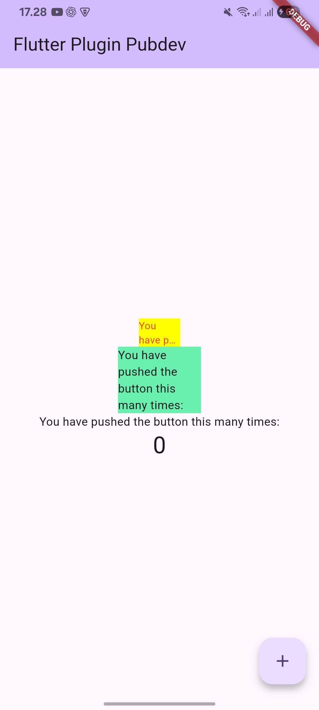

# Laporan Praktikum 07 : Manajemen Plugin

Nama  : Muhammad Farras Awaludin Alwi  
NIM   : 244107060032  
Absen : 12  

---

## Praktikum 1 : Menerapkan Plugin di Project Flutter

**Langkah 1**  
Buatlah sebuah project Flutter baru dengan nama `flutter_plugin_pubdev`.

# Laporan Praktikum 07 : Manajemen Plugin

Nama  : Muhammad Farras Awaludin Alwi  
NIM   : 244107060032  
Absen : 12  

---

## Praktikum 1 : Menerapkan Plugin di Project Flutter

**Langkah 1**  
Buatlah sebuah project Flutter baru dengan nama `flutter_plugin_pubdev`.

**Langkah 2**  
Tambahkan plugin `auto_size_text` menggunakan perintah berikut di terminal.

```bash
flutter pub add auto_size_text
```

Perintah tersebut digunakan untuk menambahkan package atau plugin `auto_size_text` ke dalam project Flutter.

Jika proses berhasil, maka plugin akan muncul pada file `pubspec.yaml` di bagian `dependencies`.

Contoh hasil pada file `pubspec.yaml`:

```yaml
dependencies:
  flutter:
    sdk: flutter
  auto_size_text: ^3.0.0
```

Plugin `auto_size_text` digunakan untuk menampilkan teks yang ukurannya dapat menyesuaikan ruang yang tersedia. Dengan plugin ini, teks dapat mengecil secara otomatis agar tetap muat di dalam widget tertentu.

---

**Langkah 3**  
Buat file baru dengan nama `red_text_widget.dart` di dalam folder `lib`.

Struktur folder project menjadi seperti berikut.

```text
flutter_plugin_pubdev
├── lib
│   ├── main.dart
│   └── red_text_widget.dart
├── pubspec.yaml
```

Kemudian isi file `red_text_widget.dart` dengan kode berikut.

```dart
import 'package:flutter/material.dart';

class RedTextWidget extends StatelessWidget {
  const RedTextWidget({Key? key}) : super(key: key);

  @override
  Widget build(BuildContext context) {
    return Container();
  }
}
```

Pada kode tersebut, dibuat class `RedTextWidget` yang merupakan turunan dari `StatelessWidget`.

Untuk sementara, method `build()` masih mengembalikan widget `Container()` kosong. Widget ini nantinya akan diubah menjadi widget `AutoSizeText`.

---

**Langkah 4**  
Tambahkan widget `AutoSizeText`.

Masih di file `red_text_widget.dart`, ubah kode `return Container();` menjadi seperti berikut.

```dart
return AutoSizeText(
  text,
  style: const TextStyle(color: Colors.red, fontSize: 14),
  maxLines: 2,
  overflow: TextOverflow.ellipsis,
);
```

Setelah kode tersebut ditambahkan, akan muncul error.

Error terjadi karena terdapat dua penyebab utama.

Pertama, widget `AutoSizeText` belum dikenali oleh program karena belum menambahkan import package `auto_size_text`.

Kode import yang harus ditambahkan adalah sebagai berikut.

```dart
import 'package:auto_size_text/auto_size_text.dart';
```

Kedua, variabel `text` belum dibuat di dalam class `RedTextWidget`. Pada kode `AutoSizeText(text, ...)`, nilai `text` digunakan sebagai isi teks yang akan ditampilkan, tetapi variabel tersebut belum dideklarasikan.

Oleh karena itu, perlu dibuat variabel `text` dan parameter pada constructor agar teks dapat dikirim dari file lain, misalnya dari `main.dart`.

---

**Langkah 5**  
Buat variabel `text` dan parameter pada constructor.

Kode pada file `red_text_widget.dart` diperbaiki menjadi seperti berikut.

```dart
import 'package:auto_size_text/auto_size_text.dart';
import 'package:flutter/material.dart';

class RedTextWidget extends StatelessWidget {
  final String text;

  const RedTextWidget({
    Key? key,
    required this.text,
  }) : super(key: key);

  @override
  Widget build(BuildContext context) {
    return AutoSizeText(
      text,
      style: const TextStyle(color: Colors.red, fontSize: 14),
      maxLines: 2,
      overflow: TextOverflow.ellipsis,
    );
  }
}
```

Pada kode tersebut, ditambahkan variabel `text` dengan tipe data `String`.

```dart
final String text;
```

Variabel tersebut digunakan untuk menyimpan teks yang akan ditampilkan oleh widget `AutoSizeText`.

Kemudian pada constructor ditambahkan parameter `required this.text`.

```dart
const RedTextWidget({
  Key? key,
  required this.text,
}) : super(key: key);
```

Keyword `required` digunakan agar parameter `text` wajib diisi ketika widget `RedTextWidget` dipanggil.

Widget `AutoSizeText` diberi style warna merah dan ukuran font awal sebesar `14`. Properti `maxLines: 2` digunakan agar teks maksimal ditampilkan dalam dua baris. Jika teks tetap tidak cukup, maka bagian akhir teks akan dipotong dan diganti dengan tanda titik-titik karena menggunakan `TextOverflow.ellipsis`.

---

**Langkah 6**  
Tambahkan widget `RedTextWidget` di file `main.dart`.

Pertama, tambahkan import file `red_text_widget.dart` pada bagian atas file `main.dart`.

```dart
import 'package:flutter_plugin_pubdev/red_text_widget.dart';
```

Kemudian tambahkan widget berikut pada bagian `children` di class `_MyHomePageState`.

```dart
Container(
  color: Colors.yellowAccent,
  width: 50,
  child: const RedTextWidget(
    text: 'You have pushed the button this many times:',
  ),
),
Container(
  color: Colors.greenAccent,
  width: 100,
  child: const Text(
    'You have pushed the button this many times:',
  ),
),
```

Kode tersebut digunakan untuk membandingkan tampilan antara widget `AutoSizeText` dan widget `Text` biasa.

Container pertama memiliki lebar `50` dan menggunakan `RedTextWidget` yang di dalamnya terdapat `AutoSizeText`.

Container kedua memiliki lebar `100` dan menggunakan widget `Text` biasa.

Kode lengkap file `main.dart` adalah sebagai berikut.

```dart
import 'package:flutter/material.dart';
import 'package:flutter_plugin_pubdev/red_text_widget.dart';

void main() {
  runApp(const MyApp());
}

class MyApp extends StatelessWidget {
  const MyApp({super.key});

  @override
  Widget build(BuildContext context) {
    return MaterialApp(
      title: 'Flutter Plugin Pubdev',
      theme: ThemeData(
        colorScheme: ColorScheme.fromSeed(seedColor: Colors.deepPurple),
      ),
      home: const MyHomePage(title: 'Flutter Plugin Pubdev'),
    );
  }
}

class MyHomePage extends StatefulWidget {
  const MyHomePage({super.key, required this.title});

  final String title;

  @override
  State<MyHomePage> createState() => _MyHomePageState();
}

class _MyHomePageState extends State<MyHomePage> {
  int _counter = 0;

  void _incrementCounter() {
    setState(() {
      _counter++;
    });
  }

  @override
  Widget build(BuildContext context) {
    return Scaffold(
      appBar: AppBar(
        backgroundColor: Theme.of(context).colorScheme.inversePrimary,
        title: Text(widget.title),
      ),
      body: Center(
        child: Column(
          mainAxisAlignment: MainAxisAlignment.center,
          children: <Widget>[
            Container(
              color: Colors.yellowAccent,
              width: 50,
              child: const RedTextWidget(
                text: 'You have pushed the button this many times:',
              ),
            ),
            Container(
              color: Colors.greenAccent,
              width: 100,
              child: const Text(
                'You have pushed the button this many times:',
              ),
            ),
            const Text(
              'You have pushed the button this many times:',
            ),
            Text(
              '$_counter',
              style: Theme.of(context).textTheme.headlineMedium,
            ),
          ],
        ),
      ),
      floatingActionButton: FloatingActionButton(
        onPressed: _incrementCounter,
        tooltip: 'Increment',
        child: const Icon(Icons.add),
      ),
    );
  }
}
```

Setelah kode selesai ditambahkan, jalankan aplikasi dengan menekan tombol **F5** atau menggunakan perintah berikut.

```bash
flutter run
```

Output kode:



Setelah aplikasi dijalankan, terlihat dua tampilan teks yang berbeda.

Pada container berwarna kuning dengan lebar `50`, teks ditampilkan menggunakan `RedTextWidget` yang memakai plugin `AutoSizeText`. Teks dapat menyesuaikan ukuran ruang yang tersedia, berwarna merah, dan maksimal ditampilkan dalam dua baris.

Pada container berwarna hijau dengan lebar `100`, teks ditampilkan menggunakan widget `Text` biasa. Widget `Text` tidak menyesuaikan ukuran font secara otomatis seperti `AutoSizeText`.

Dengan demikian, plugin `auto_size_text` berhasil diterapkan pada project Flutter.

---

---

### Penjelasan

Pada praktikum ini, saya mempelajari cara menambahkan dan menggunakan plugin dari `pub.dev` pada project Flutter.

Plugin yang digunakan adalah `auto_size_text`. Plugin ini berfungsi untuk membuat ukuran teks menyesuaikan ruang yang tersedia secara otomatis.

Project Flutter dibuat dengan nama `flutter_plugin_pubdev`. Setelah itu, plugin ditambahkan menggunakan perintah `flutter pub add auto_size_text`. Perintah tersebut secara otomatis menambahkan dependency plugin ke dalam file `pubspec.yaml`.

Selanjutnya, dibuat file baru bernama `red_text_widget.dart` di dalam folder `lib`. File tersebut berisi class `RedTextWidget` yang digunakan untuk menampilkan teks berwarna merah menggunakan widget `AutoSizeText`.

Pada awalnya, ketika widget `AutoSizeText` langsung digunakan, muncul error. Error tersebut terjadi karena package `auto_size_text` belum di-import dan variabel `text` belum dideklarasikan. Setelah menambahkan import `package:auto_size_text/auto_size_text.dart` dan membuat variabel `text` beserta parameter constructor, error berhasil diperbaiki.

Pada file `main.dart`, widget `RedTextWidget` ditambahkan ke dalam `children` pada class `_MyHomePageState`. Widget tersebut diletakkan di dalam `Container` berwarna kuning dengan lebar `50`. Selain itu, ditambahkan juga widget `Text` biasa di dalam `Container` berwarna hijau dengan lebar `100`.

Hasilnya, widget `AutoSizeText` dapat menyesuaikan ukuran teks agar tetap muat di dalam container yang sempit. Sedangkan widget `Text` biasa tidak memiliki kemampuan menyesuaikan ukuran font secara otomatis.

Dengan demikian, Praktikum 1 berhasil menerapkan plugin `auto_size_text` pada project Flutter.