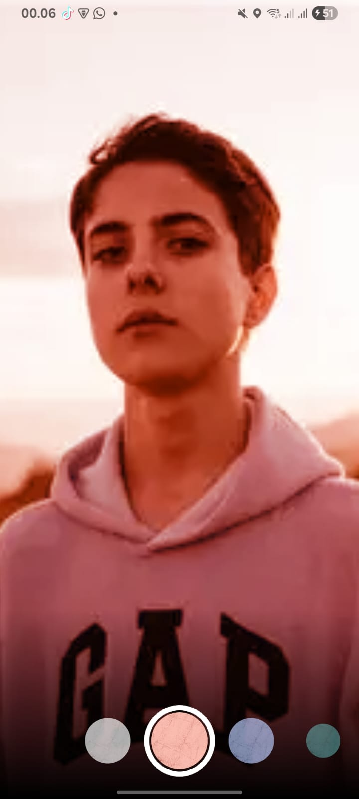
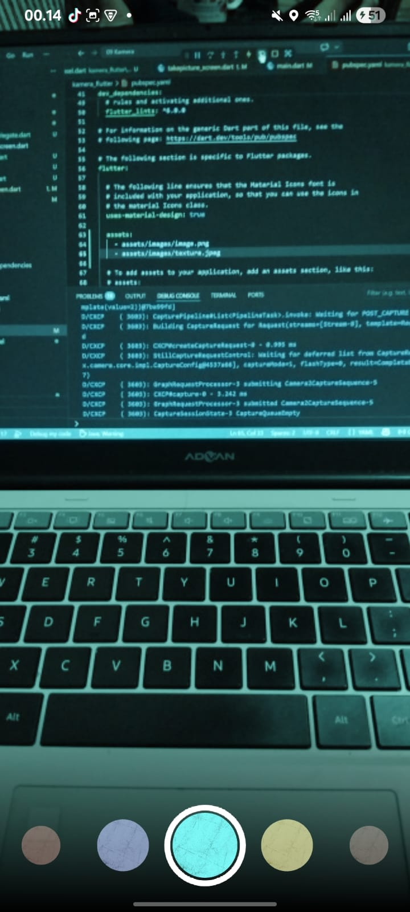

# Laporan Praktikum 09 : Kamera

Nama  : Muhammad Farras Awaludin Alwi  
NIM   : 244107060032  
Absen : 12  

---

## Praktikum 1 : Mengambil Foto dengan Kamera di Flutter

**Langkah 1**  
Buatlah sebuah project Flutter baru dengan nama `kamera_flutter`.

---

**Langkah 2**  
Tambahkan dependensi yang diperlukan pada project Flutter.

Pada praktikum ini terdapat tiga dependensi yang digunakan, yaitu `camera`, `path_provider`, dan `path`.

```bash
flutter pub add camera path_provider path
```

Fungsi dari masing-masing dependensi adalah sebagai berikut.

```text
camera        : digunakan untuk mengakses dan mengontrol kamera pada device
path_provider : digunakan untuk mendapatkan lokasi penyimpanan file pada device
path          : digunakan untuk mengatur path file agar mendukung berbagai platform
```

Jika proses berhasil, maka dependensi akan muncul pada file `pubspec.yaml` di bagian `dependencies`.

Contoh isi bagian `dependencies` pada file `pubspec.yaml` adalah sebagai berikut.

```yaml
dependencies:
  flutter:
    sdk: flutter
  camera:
  path_provider:
  path:
```

Untuk Android, pastikan nilai `minSdkVersion` pada file Gradle minimal `21`.

```gradle
minSdkVersion 21
```

Pada langkah ini, project sudah memiliki package yang diperlukan untuk mengakses kamera dan mengelola file hasil foto.

---

**Langkah 3**  
Ambil sensor kamera dari device.

Buka file `lib/main.dart`, kemudian ubah fungsi `main()` menjadi fungsi `async`.

Kode ini digunakan untuk memastikan plugin Flutter sudah siap digunakan sebelum aplikasi dijalankan.

```dart
WidgetsFlutterBinding.ensureInitialized();
```

Selanjutnya, ambil daftar kamera yang tersedia pada device menggunakan fungsi `availableCameras()`.

```dart
final cameras = await availableCameras();
```

Kemudian ambil kamera pertama dari daftar kamera yang tersedia.

```dart
final firstCamera = cameras.first;
```

Kode lengkap awal pada file `main.dart` adalah sebagai berikut.

```dart
import 'package:camera/camera.dart';
import 'package:flutter/material.dart';
import 'widget/takepicture_screen.dart';

Future<void> main() async {
  WidgetsFlutterBinding.ensureInitialized();

  final cameras = await availableCameras();

  final firstCamera = cameras.first;

  runApp(
    MaterialApp(
      theme: ThemeData.dark(),
      home: TakePictureScreen(
        camera: firstCamera,
      ),
      debugShowCheckedModeBanner: false,
    ),
  );
}
```

Pada langkah ini, aplikasi sudah dapat mendeteksi kamera yang tersedia pada perangkat.

---

**Langkah 4**  
Buat dan inisialisasi `CameraController`.

Buat folder baru bernama `widget` di dalam folder `lib`.

Kemudian buat file baru dengan nama `takepicture_screen.dart`.

Struktur folder project menjadi seperti berikut.

```text
kamera_flutter
├── lib
│   ├── main.dart
│   └── widget
│       └── takepicture_screen.dart
├── pubspec.yaml
```

Isi file `lib/widget/takepicture_screen.dart` dengan kode berikut.

```dart
import 'package:camera/camera.dart';
import 'package:flutter/material.dart';

class TakePictureScreen extends StatefulWidget {
  const TakePictureScreen({
    super.key,
    required this.camera,
  });

  final CameraDescription camera;

  @override
  TakePictureScreenState createState() => TakePictureScreenState();
}

class TakePictureScreenState extends State<TakePictureScreen> {
  late CameraController _controller;
  late Future<void> _initializeControllerFuture;

  @override
  void initState() {
    super.initState();

    _controller = CameraController(
      widget.camera,
      ResolutionPreset.medium,
    );

    _initializeControllerFuture = _controller.initialize();
  }

  @override
  void dispose() {
    _controller.dispose();
    super.dispose();
  }

  @override
  Widget build(BuildContext context) {
    return Container();
  }
}
```

Pada kode tersebut, dibuat class `TakePictureScreen` sebagai halaman untuk mengambil gambar menggunakan kamera.

Variabel `_controller` digunakan untuk menyimpan objek `CameraController`. Controller ini berfungsi untuk menghubungkan aplikasi dengan kamera device.

Variabel `_initializeControllerFuture` digunakan untuk menyimpan proses inisialisasi kamera. Karena proses inisialisasi kamera berjalan secara asynchronous, maka digunakan tipe data `Future<void>`.

Method `initState()` digunakan untuk membuat dan menginisialisasi `CameraController` saat halaman pertama kali dibuat.

Method `dispose()` digunakan untuk menghapus controller ketika halaman tidak digunakan lagi. Hal ini penting agar resource kamera tidak terus berjalan di background.

---

**Langkah 5**  
Gunakan `CameraPreview` untuk menampilkan preview kamera.

Masih pada file `takepicture_screen.dart`, ubah bagian method `build()` menjadi seperti berikut.

```dart
@override
Widget build(BuildContext context) {
  return Scaffold(
    appBar: AppBar(
      title: const Text('Take a picture - 244107060032'),
    ),
    body: FutureBuilder<void>(
      future: _initializeControllerFuture,
      builder: (context, snapshot) {
        if (snapshot.connectionState == ConnectionState.done) {
          return CameraPreview(_controller);
        } else {
          return const Center(
            child: CircularProgressIndicator(),
          );
        }
      },
    ),
  );
}
```

Pada kode tersebut, `FutureBuilder` digunakan untuk menunggu proses inisialisasi kamera selesai.

Jika proses inisialisasi sudah selesai, maka aplikasi akan menampilkan preview kamera menggunakan widget `CameraPreview`.

```dart
return CameraPreview(_controller);
```

Jika proses inisialisasi belum selesai, maka aplikasi akan menampilkan loading menggunakan `CircularProgressIndicator`.

```dart
return const Center(
  child: CircularProgressIndicator(),
);
```

Dengan demikian, preview kamera hanya akan ditampilkan setelah kamera benar-benar siap digunakan.

---

**Langkah 6**  
Ambil foto menggunakan `CameraController`.

Tambahkan `FloatingActionButton` pada bagian `Scaffold` setelah field `body`.

Kode method `build()` menjadi seperti berikut.

```dart
@override
Widget build(BuildContext context) {
  return Scaffold(
    appBar: AppBar(
      title: const Text('Take a picture - 244107060032'),
    ),
    body: FutureBuilder<void>(
      future: _initializeControllerFuture,
      builder: (context, snapshot) {
        if (snapshot.connectionState == ConnectionState.done) {
          return CameraPreview(_controller);
        } else {
          return const Center(
            child: CircularProgressIndicator(),
          );
        }
      },
    ),
    floatingActionButton: FloatingActionButton(
      onPressed: () async {
        try {
          await _initializeControllerFuture;

          final image = await _controller.takePicture();
        } catch (e) {
          print(e);
        }
      },
      child: const Icon(Icons.camera_alt),
    ),
  );
}
```

Pada kode tersebut, `FloatingActionButton` digunakan sebagai tombol untuk mengambil foto.

Ketika tombol ditekan, program akan memastikan kamera sudah selesai diinisialisasi dengan kode berikut.

```dart
await _initializeControllerFuture;
```

Setelah itu, kamera mengambil gambar menggunakan method `takePicture()`.

```dart
final image = await _controller.takePicture();
```

Proses pengambilan gambar dibungkus menggunakan blok `try-catch` untuk menangani error jika terjadi masalah saat kamera digunakan.

Pada langkah ini, aplikasi sudah dapat mengambil foto, tetapi hasil foto belum ditampilkan pada halaman baru.

---

**Langkah 7**  
Buat widget baru `DisplayPictureScreen`.

Buat file baru pada folder `widget` dengan nama `displaypicture_screen.dart`.

Struktur folder project menjadi seperti berikut.

```text
kamera_flutter
├── lib
│   ├── main.dart
│   └── widget
│       ├── takepicture_screen.dart
│       └── displaypicture_screen.dart
├── pubspec.yaml
```

Isi file `lib/widget/displaypicture_screen.dart` dengan kode berikut.

```dart
import 'dart:io';

import 'package:flutter/material.dart';

class DisplayPictureScreen extends StatelessWidget {
  final String imagePath;

  const DisplayPictureScreen({
    super.key,
    required this.imagePath,
  });

  @override
  Widget build(BuildContext context) {
    return Scaffold(
      appBar: AppBar(
        title: const Text('Display the Picture - 244107060032'),
      ),
      body: Image.file(
        File(imagePath),
      ),
    );
  }
}
```

Pada kode tersebut, dibuat class `DisplayPictureScreen` yang digunakan untuk menampilkan hasil foto.

Variabel `imagePath` digunakan untuk menyimpan lokasi file gambar yang telah diambil oleh kamera.

Widget `Image.file` digunakan untuk menampilkan gambar dari file yang tersimpan pada device.

```dart
Image.file(
  File(imagePath),
)
```

Agar `File` dapat digunakan, perlu menambahkan import berikut.

```dart
import 'dart:io';
```

---

**Langkah 8**  
Edit file `main.dart`.

Pada file `main.dart`, bagian `runApp()` diubah agar aplikasi langsung membuka halaman `TakePictureScreen`.

Kode lengkap file `main.dart` adalah sebagai berikut.

```dart
import 'package:camera/camera.dart';
import 'package:flutter/material.dart';
import 'widget/takepicture_screen.dart';

Future<void> main() async {
  WidgetsFlutterBinding.ensureInitialized();

  final cameras = await availableCameras();

  final firstCamera = cameras.first;

  runApp(
    MaterialApp(
      theme: ThemeData.dark(),
      home: TakePictureScreen(
        camera: firstCamera,
      ),
      debugShowCheckedModeBanner: false,
    ),
  );
}
```

Pada kode tersebut, `ThemeData.dark()` digunakan untuk memberikan tema gelap pada aplikasi.

```dart
theme: ThemeData.dark(),
```

Properti `home` digunakan untuk menentukan halaman pertama yang ditampilkan, yaitu `TakePictureScreen`.

```dart
home: TakePictureScreen(
  camera: firstCamera,
),
```

Kamera pertama yang sebelumnya sudah didapatkan dikirim ke halaman `TakePictureScreen` melalui parameter `camera`.

---

**Langkah 9**  
Menampilkan hasil foto.

Agar hasil foto dapat ditampilkan, tambahkan import file `displaypicture_screen.dart` pada file `takepicture_screen.dart`.

```dart
import 'displaypicture_screen.dart';
```

Kemudian ubah isi `onPressed` pada `FloatingActionButton` menjadi seperti berikut.

```dart
onPressed: () async {
  try {
    await _initializeControllerFuture;

    final image = await _controller.takePicture();

    if (!context.mounted) return;

    await Navigator.of(context).push(
      MaterialPageRoute(
        builder: (context) => DisplayPictureScreen(
          imagePath: image.path,
        ),
      ),
    );
  } catch (e) {
    print(e);
  }
},
```

Pada kode tersebut, setelah foto berhasil diambil, hasil foto disimpan ke dalam variabel `image`.

```dart
final image = await _controller.takePicture();
```

Kemudian dilakukan pengecekan `context.mounted`.

```dart
if (!context.mounted) return;
```

Pengecekan ini digunakan untuk memastikan widget masih aktif sebelum melakukan navigasi ke halaman lain.

Setelah itu, aplikasi berpindah ke halaman `DisplayPictureScreen` menggunakan `Navigator`.

```dart
await Navigator.of(context).push(
  MaterialPageRoute(
    builder: (context) => DisplayPictureScreen(
      imagePath: image.path,
    ),
  ),
);
```

Path gambar dikirim ke halaman `DisplayPictureScreen` melalui parameter `imagePath`.

Dengan demikian, setelah pengguna menekan tombol kamera, aplikasi akan mengambil foto dan menampilkan hasil foto pada halaman baru.


---

### Output Praktikum

Setelah aplikasi dijalankan pada device atau smartphone, aplikasi akan menampilkan preview kamera.

Output preview kamera:


Ketika tombol kamera ditekan, aplikasi akan mengambil foto dan menampilkan hasil foto pada halaman baru.

Output hasil foto:


---

### Penjelasan

Pada praktikum ini, saya mempelajari cara menggunakan kamera pada aplikasi Flutter.

Project dibuat dengan nama `kamera_flutter`. Setelah itu, ditambahkan beberapa dependensi yang dibutuhkan, yaitu `camera`, `path_provider`, dan `path`.

Package `camera` digunakan untuk mengakses kamera pada device. Package `path_provider` digunakan untuk mendapatkan lokasi penyimpanan file pada device. Package `path` digunakan untuk membantu pengaturan path agar dapat mendukung berbagai platform.

Pada file `main.dart`, fungsi `main()` dibuat menjadi asynchronous dengan menggunakan `Future<void> main() async`. Hal ini dilakukan karena aplikasi perlu mengambil daftar kamera yang tersedia sebelum `runApp()` dijalankan.

Kode `WidgetsFlutterBinding.ensureInitialized()` digunakan agar plugin Flutter sudah siap digunakan sebelum memanggil fungsi `availableCameras()`.

Setelah daftar kamera diperoleh, kamera pertama disimpan ke dalam variabel `firstCamera`, kemudian dikirim ke halaman `TakePictureScreen`.

Pada halaman `TakePictureScreen`, dibuat `CameraController` untuk mengontrol kamera. Controller tersebut diinisialisasi pada method `initState()` dan dihapus pada method `dispose()`.

Untuk menampilkan preview kamera, digunakan widget `CameraPreview`. Karena proses inisialisasi kamera berjalan secara asynchronous, maka digunakan `FutureBuilder` untuk menunggu kamera siap digunakan. Jika kamera sudah siap, preview kamera akan ditampilkan. Jika belum siap, aplikasi akan menampilkan loading.

Pada bagian bawah layar ditambahkan `FloatingActionButton` dengan ikon kamera. Tombol ini digunakan untuk mengambil foto menggunakan method `takePicture()` dari `CameraController`.

Setelah foto berhasil diambil, aplikasi berpindah ke halaman `DisplayPictureScreen`. Halaman ini menerima path gambar melalui parameter `imagePath`, kemudian menampilkan gambar menggunakan widget `Image.file`.

Dengan demikian, Praktikum 1 berhasil membuat aplikasi Flutter yang dapat mengakses kamera, menampilkan preview kamera, mengambil foto, dan menampilkan hasil foto pada halaman baru.

---

### Kesimpulan

Pada Praktikum 1 Jobsheet 9 ini, saya berhasil membuat aplikasi kamera sederhana menggunakan Flutter.

Aplikasi ini dapat mengambil daftar kamera pada device, memilih kamera pertama, menampilkan preview kamera, mengambil foto, dan menampilkan hasil foto.

Plugin utama yang digunakan adalah `camera`, sedangkan `path_provider` dan `path` digunakan untuk mendukung pengelolaan lokasi file pada berbagai platform.

Dengan praktikum ini, saya memahami cara kerja dasar kamera di Flutter, mulai dari inisialisasi kamera menggunakan `CameraController`, menampilkan preview dengan `CameraPreview`, mengambil foto dengan `takePicture()`, hingga menampilkan hasil foto menggunakan `Image.file`.

---

## Praktikum 2 : Membuat Photo Filter Carousel

**Langkah 1**  
Buatlah project Flutter baru dengan nama `photo_filter_carousel`.

Pada langkah ini, project Flutter baru berhasil dibuat. Project ini digunakan untuk membuat aplikasi photo filter carousel, yaitu tampilan foto dengan pilihan filter warna yang dapat digeser secara horizontal.

---

**Langkah 2**  
Buat folder baru bernama `widget` di dalam folder `lib`.

Kemudian buat file baru dengan nama `filter_selector.dart`.

Struktur folder project menjadi seperti berikut.

```text
photo_filter_carousel
├── lib
│   ├── main.dart
│   └── widget
│       └── filter_selector.dart
├── pubspec.yaml
```

File `filter_selector.dart` digunakan untuk membuat tampilan pilihan filter warna yang dapat digeser. Widget ini juga membuat selection ring atau lingkaran putih sebagai penanda filter yang sedang dipilih, serta dark gradient pada bagian bawah layar.

Isi file `lib/widget/filter_selector.dart` adalah sebagai berikut.

```dart
import 'package:flutter/material.dart';
import 'package:flutter/rendering.dart' show ViewportOffset;

import 'carousel_flowdelegate.dart';
import 'filter_item.dart';

@immutable
class FilterSelector extends StatefulWidget {
  const FilterSelector({
    super.key,
    required this.filters,
    required this.onFilterChanged,
    this.padding = const EdgeInsets.symmetric(vertical: 24),
  });

  final List<Color> filters;
  final void Function(Color selectedColor) onFilterChanged;
  final EdgeInsets padding;

  @override
  State<FilterSelector> createState() => _FilterSelectorState();
}

class _FilterSelectorState extends State<FilterSelector> {
  static const _filtersPerScreen = 5;
  static const _viewportFractionPerItem = 1.0 / _filtersPerScreen;

  late final PageController _controller;
  late int _page;

  int get filterCount => widget.filters.length;

  Color itemColor(int index) => widget.filters[index % filterCount];

  @override
  void initState() {
    super.initState();
    _page = 0;
    _controller = PageController(
      initialPage: _page,
      viewportFraction: _viewportFractionPerItem,
    );
    _controller.addListener(_onPageChanged);
  }

  void _onPageChanged() {
    final page = (_controller.page ?? 0).round();
    if (page != _page) {
      _page = page;
      widget.onFilterChanged(widget.filters[page]);
    }
  }

  void _onFilterTapped(int index) {
    _controller.animateToPage(
      index,
      duration: const Duration(milliseconds: 450),
      curve: Curves.ease,
    );
  }

  @override
  void dispose() {
    _controller.dispose();
    super.dispose();
  }

  @override
  Widget build(BuildContext context) {
    return Scrollable(
      controller: _controller,
      axisDirection: AxisDirection.right,
      physics: const PageScrollPhysics(),
      viewportBuilder: (context, viewportOffset) {
        return LayoutBuilder(
          builder: (context, constraints) {
            final itemSize = constraints.maxWidth * _viewportFractionPerItem;
            viewportOffset
              ..applyViewportDimension(constraints.maxWidth)
              ..applyContentDimensions(0.0, itemSize * (filterCount - 1));

            return Stack(
              alignment: Alignment.bottomCenter,
              children: [
                _buildShadowGradient(itemSize),
                _buildCarousel(
                  viewportOffset: viewportOffset,
                  itemSize: itemSize,
                ),
                _buildSelectionRing(itemSize),
              ],
            );
          },
        );
      },
    );
  }

  Widget _buildShadowGradient(double itemSize) {
    return SizedBox(
      height: itemSize * 2 + widget.padding.vertical,
      child: const DecoratedBox(
        decoration: BoxDecoration(
          gradient: LinearGradient(
            begin: Alignment.topCenter,
            end: Alignment.bottomCenter,
            colors: [
              Colors.transparent,
              Colors.black,
            ],
          ),
        ),
        child: SizedBox.expand(),
      ),
    );
  }

  Widget _buildCarousel({
    required ViewportOffset viewportOffset,
    required double itemSize,
  }) {
    return Container(
      height: itemSize,
      margin: widget.padding,
      child: Flow(
        delegate: CarouselFlowDelegate(
          viewportOffset: viewportOffset,
          filtersPerScreen: _filtersPerScreen,
        ),
        children: [
          for (int i = 0; i < filterCount; i++)
            FilterItem(
              onFilterSelected: () => _onFilterTapped(i),
              color: itemColor(i),
            ),
        ],
      ),
    );
  }

  Widget _buildSelectionRing(double itemSize) {
    return IgnorePointer(
      child: Padding(
        padding: widget.padding,
        child: SizedBox(
          width: itemSize,
          height: itemSize,
          child: const DecoratedBox(
            decoration: BoxDecoration(
              shape: BoxShape.circle,
              border: Border.fromBorderSide(
                BorderSide(width: 6, color: Colors.white),
              ),
            ),
          ),
        ),
      ),
    );
  }
}
```

Pada kode tersebut, class `FilterSelector` dibuat sebagai `StatefulWidget` karena filter yang dipilih dapat berubah ketika carousel digeser.

Variabel `filters` digunakan untuk menyimpan daftar warna filter. Variabel `onFilterChanged` digunakan untuk mengirim warna filter yang sedang dipilih ke widget lain. Variabel `padding` digunakan untuk memberikan jarak pada bagian atas dan bawah selector.

`PageController` digunakan untuk mengontrol pergeseran carousel. Ketika halaman atau filter berubah, method `_onPageChanged()` akan memanggil `onFilterChanged` agar warna filter pada foto ikut berubah.

Method `_buildShadowGradient()` digunakan untuk membuat efek gradasi gelap pada bagian bawah layar. Method `_buildCarousel()` digunakan untuk membuat daftar item filter yang dapat digeser. Method `_buildSelectionRing()` digunakan untuk membuat lingkaran putih sebagai penanda filter yang sedang dipilih.

---

**Langkah 3**  
Buat file baru bernama `filter_carousel.dart` di dalam folder `widget`.

File ini digunakan sebagai tampilan utama aplikasi photo filter carousel.

Struktur folder menjadi seperti berikut.

```text
photo_filter_carousel
├── lib
│   ├── main.dart
│   └── widget
│       ├── filter_selector.dart
│       └── filter_carousel.dart
├── pubspec.yaml
```

Isi file `lib/widget/filter_carousel.dart` adalah sebagai berikut.

```dart
import 'package:flutter/material.dart';

import 'filter_selector.dart';

@immutable
class PhotoFilterCarousel extends StatefulWidget {
  const PhotoFilterCarousel({super.key});

  @override
  State<PhotoFilterCarousel> createState() => _PhotoFilterCarouselState();
}

class _PhotoFilterCarouselState extends State<PhotoFilterCarousel> {
  final _filters = [
    Colors.white,
    ...List.generate(
      Colors.primaries.length,
      (index) => Colors.primaries[(index * 4) % Colors.primaries.length],
    )
  ];

  final _filterColor = ValueNotifier<Color>(Colors.white);

  void _onFilterChanged(Color value) {
    _filterColor.value = value;
  }

  @override
  Widget build(BuildContext context) {
    return Material(
      color: Colors.black,
      child: Stack(
        children: [
          Positioned.fill(
            child: _buildPhotoWithFilter(),
          ),
          Positioned(
            left: 0.0,
            right: 0.0,
            bottom: 0.0,
            child: _buildFilterSelector(),
          ),
        ],
      ),
    );
  }

  Widget _buildPhotoWithFilter() {
    return ValueListenableBuilder(
      valueListenable: _filterColor,
      builder: (context, color, child) {
        return Image.network(
          'https://docs.flutter.dev/cookbook/img-files'
          '/effects/instagram-buttons/millennial-dude.jpg',
          color: color.withOpacity(0.5),
          colorBlendMode: BlendMode.color,
          fit: BoxFit.cover,
        );
      },
    );
  }

  Widget _buildFilterSelector() {
    return FilterSelector(
      onFilterChanged: _onFilterChanged,
      filters: _filters,
    );
  }
}
```

Pada kode tersebut, class `PhotoFilterCarousel` digunakan untuk menampilkan foto dan pilihan filter.

Variabel `_filters` berisi daftar warna yang digunakan sebagai pilihan filter. Warna pertama adalah `Colors.white`, kemudian dilanjutkan dengan beberapa warna dari `Colors.primaries`.

Variabel `_filterColor` menggunakan `ValueNotifier<Color>` untuk menyimpan warna filter yang sedang aktif. Ketika filter berubah, method `_onFilterChanged()` akan memperbarui nilai `_filterColor`.

Widget `ValueListenableBuilder` digunakan agar tampilan foto dapat berubah secara otomatis ketika nilai `_filterColor` berubah.

Foto ditampilkan menggunakan `Image.network`. Warna filter diterapkan menggunakan properti `color` dan `colorBlendMode`.

```dart
color: color.withOpacity(0.5),
colorBlendMode: BlendMode.color,
```

Dengan kode tersebut, warna filter akan dicampurkan ke gambar utama.

---

**Langkah 4**  
Buat file baru bernama `carousel_flowdelegate.dart` di dalam folder `widget`.

File ini digunakan untuk mengatur posisi, ukuran, dan transparansi setiap item filter pada carousel.

Struktur folder menjadi seperti berikut.

```text
photo_filter_carousel
├── lib
│   ├── main.dart
│   └── widget
│       ├── filter_selector.dart
│       ├── filter_carousel.dart
│       └── carousel_flowdelegate.dart
├── pubspec.yaml
```

Isi file `lib/widget/carousel_flowdelegate.dart` adalah sebagai berikut.

```dart
import 'dart:math' as math;

import 'package:flutter/material.dart';
import 'package:flutter/rendering.dart' show ViewportOffset;

class CarouselFlowDelegate extends FlowDelegate {
  CarouselFlowDelegate({
    required this.viewportOffset,
    required this.filtersPerScreen,
  }) : super(repaint: viewportOffset);

  final ViewportOffset viewportOffset;
  final int filtersPerScreen;

  @override
  void paintChildren(FlowPaintingContext context) {
    final count = context.childCount;

    final size = context.size.width;

    final itemExtent = size / filtersPerScreen;

    final active = viewportOffset.pixels / itemExtent;

    final min = math.max(0, active.floor() - 3).toInt();

    final max = math.min(count - 1, active.ceil() + 3).toInt();

    for (var index = min; index <= max; index++) {
      final itemXFromCenter = itemExtent * index - viewportOffset.pixels;
      final percentFromCenter = 1.0 - (itemXFromCenter / (size / 2)).abs();
      final itemScale = 0.5 + (percentFromCenter * 0.5);
      final opacity = 0.25 + (percentFromCenter * 0.75);

      final itemTransform = Matrix4.identity()
        ..translate((size - itemExtent) / 2)
        ..translate(itemXFromCenter)
        ..translate(itemExtent / 2, itemExtent / 2)
        ..multiply(Matrix4.diagonal3Values(itemScale, itemScale, 1.0))
        ..translate(-itemExtent / 2, -itemExtent / 2);

      context.paintChild(
        index,
        transform: itemTransform,
        opacity: opacity,
      );
    }
  }

  @override
  bool shouldRepaint(covariant CarouselFlowDelegate oldDelegate) {
    return oldDelegate.viewportOffset != viewportOffset;
  }
}
```

Pada kode tersebut, class `CarouselFlowDelegate` digunakan untuk mengatur cara item filter digambar pada layar.

Method `paintChildren()` digunakan untuk menghitung posisi setiap item filter. Item yang berada di tengah akan terlihat lebih besar dan lebih jelas, sedangkan item yang berada di sisi kiri atau kanan akan terlihat lebih kecil dan transparan.

Variabel `itemScale` digunakan untuk mengatur ukuran item filter. Variabel `opacity` digunakan untuk mengatur transparansi item filter. Semakin dekat item ke tengah layar, maka ukuran dan opacity akan semakin besar.

Method `shouldRepaint()` digunakan untuk menentukan apakah tampilan perlu digambar ulang. Jika posisi scroll berubah, maka carousel perlu di-render ulang agar posisi item filter ikut berubah.

---

**Langkah 5**  
Buat file baru bernama `filter_item.dart` di dalam folder `widget`.

File ini digunakan untuk membuat bentuk setiap item filter warna.

Struktur folder menjadi seperti berikut.

```text
photo_filter_carousel
├── lib
│   ├── main.dart
│   └── widget
│       ├── filter_selector.dart
│       ├── filter_carousel.dart
│       ├── carousel_flowdelegate.dart
│       └── filter_item.dart
├── pubspec.yaml
```

Isi file `lib/widget/filter_item.dart` adalah sebagai berikut.

```dart
import 'package:flutter/material.dart';

@immutable
class FilterItem extends StatelessWidget {
  const FilterItem({
    super.key,
    required this.color,
    this.onFilterSelected,
  });

  final Color color;
  final VoidCallback? onFilterSelected;

  @override
  Widget build(BuildContext context) {
    return GestureDetector(
      onTap: onFilterSelected,
      child: AspectRatio(
        aspectRatio: 1.0,
        child: Padding(
          padding: const EdgeInsets.all(8),
          child: ClipOval(
            child: Image.network(
              'https://docs.flutter.dev/cookbook/img-files'
              '/effects/instagram-buttons/millennial-texture.jpg',
              color: color.withOpacity(0.5),
              colorBlendMode: BlendMode.hardLight,
            ),
          ),
        ),
      ),
    );
  }
}
```

Pada kode tersebut, class `FilterItem` digunakan untuk membuat item filter berbentuk lingkaran.

Widget `GestureDetector` digunakan agar item filter dapat ditekan. Ketika item ditekan, fungsi `onFilterSelected` akan dijalankan.

Widget `AspectRatio` digunakan agar ukuran item tetap berbentuk persegi dengan rasio `1.0`.

Widget `ClipOval` digunakan untuk membuat gambar berbentuk lingkaran.

Gambar filter ditampilkan menggunakan `Image.network`, kemudian diberi warna filter menggunakan properti `color` dan `colorBlendMode`.

```dart
color: color.withOpacity(0.5),
colorBlendMode: BlendMode.hardLight,
```

Dengan demikian, setiap item filter akan menampilkan warna yang berbeda sesuai dengan data warna yang dikirimkan.

---

**Langkah 6**  
Implementasikan `PhotoFilterCarousel` pada file `main.dart`.

Buka file `lib/main.dart`, kemudian ubah seluruh isi file menjadi seperti berikut.

```dart
import 'package:flutter/material.dart';

import 'widget/filter_carousel.dart';

void main() {
  runApp(
    const MaterialApp(
      home: PhotoFilterCarousel(),
      debugShowCheckedModeBanner: false,
    ),
  );
}
```

Pada kode tersebut, `PhotoFilterCarousel` dijadikan sebagai halaman utama aplikasi melalui properti `home`.

```dart
home: PhotoFilterCarousel(),
```

Properti `debugShowCheckedModeBanner: false` digunakan untuk menghilangkan tulisan debug pada pojok kanan atas aplikasi.

Setelah semua file selesai dibuat, jalankan aplikasi dengan perintah berikut.

```bash
flutter run
```

Atau jalankan menggunakan tombol **F5** pada Visual Studio Code.

---

### Output Praktikum

Setelah aplikasi dijalankan, aplikasi menampilkan halaman photo filter carousel.

Output aplikasi:



Pada hasil yang ditampilkan, bagian utama aplikasi menggunakan background gelap. Di bagian bawah terdapat selector berbentuk lingkaran putih yang digunakan untuk menandai filter yang sedang dipilih.

Jika gambar dari `Image.network` berhasil dimuat, maka foto utama akan tampil dan warna foto akan berubah sesuai filter yang dipilih. Jika gambar belum tampil, bagian utama aplikasi akan tetap terlihat gelap karena background utama pada widget `Material` menggunakan warna hitam.

---

### Penjelasan

Pada praktikum ini, saya mempelajari cara membuat photo filter carousel menggunakan Flutter.

Project dibuat dengan nama `photo_filter_carousel`. Pada project ini dibuat beberapa file widget, yaitu `filter_carousel.dart`, `filter_selector.dart`, `carousel_flowdelegate.dart`, dan `filter_item.dart`.

File `filter_carousel.dart` digunakan sebagai halaman utama aplikasi. Di dalam file ini terdapat widget `PhotoFilterCarousel` yang berfungsi untuk menampilkan foto utama dan selector filter pada bagian bawah layar.

Foto utama ditampilkan menggunakan `Image.network`. Warna filter diterapkan pada foto menggunakan properti `color` dan `colorBlendMode`. Warna filter disimpan menggunakan `ValueNotifier<Color>`, sehingga ketika filter berubah, tampilan foto ikut diperbarui.

File `filter_selector.dart` digunakan untuk membuat daftar filter yang dapat digeser secara horizontal. Widget ini menggunakan `Scrollable`, `PageController`, dan `Flow` untuk membuat efek carousel. Selain itu, widget ini juga membuat selection ring berbentuk lingkaran putih sebagai penanda filter yang sedang aktif.

File `carousel_flowdelegate.dart` digunakan untuk mengatur tampilan item filter pada carousel. Dengan menggunakan `FlowDelegate`, posisi, ukuran, dan opacity item filter dapat diatur berdasarkan jaraknya dari posisi tengah. Item yang berada di tengah akan terlihat lebih besar dan jelas, sedangkan item yang berada di samping akan terlihat lebih kecil dan transparan.

File `filter_item.dart` digunakan untuk membuat setiap item filter. Widget ini menggunakan `GestureDetector` agar item filter dapat ditekan. Gambar filter dibuat berbentuk lingkaran menggunakan `ClipOval`, kemudian diberi efek warna menggunakan `colorBlendMode`.

Pada file `main.dart`, widget `PhotoFilterCarousel` dijadikan halaman utama aplikasi. Properti `debugShowCheckedModeBanner: false` digunakan untuk menghilangkan tulisan debug pada pojok kanan atas.

Dengan demikian, Praktikum 2 berhasil membuat tampilan photo filter carousel sederhana menggunakan Flutter.

---

### Kesimpulan

Pada Praktikum 2 Jobsheet 9 ini, saya berhasil membuat aplikasi photo filter carousel.

Aplikasi ini menampilkan foto utama dengan filter warna yang dapat dipilih melalui carousel di bagian bawah layar. Setiap filter ditampilkan dalam bentuk lingkaran dan dapat digeser ke kanan atau kiri.

Praktikum ini memperkenalkan penggunaan beberapa widget penting seperti `Stack`, `Positioned`, `ValueListenableBuilder`, `Scrollable`, `Flow`, `FlowDelegate`, `GestureDetector`, dan `ClipOval`.

Dengan praktikum ini, saya memahami cara membuat tampilan carousel custom dan menerapkan efek warna pada gambar menggunakan Flutter.

---

## Tugas Praktikum

### 1. Menyelesaikan Praktikum 1 dan Praktikum 2

Praktikum 1 dan Praktikum 2 telah diselesaikan.

Pada Praktikum 1, aplikasi dibuat untuk mengakses kamera perangkat, menampilkan preview kamera, mengambil foto, dan menampilkan hasil foto.

Pada Praktikum 2, aplikasi dibuat untuk menampilkan photo filter carousel, yaitu tampilan foto dengan pilihan filter warna yang dapat digeser secara horizontal.

Hasil pekerjaan didokumentasikan menggunakan screenshot dan dimasukkan ke dalam file `README.md`.

Daftar screenshot yang digunakan:

```text
img/praktikum1_preview.jpeg
img/praktikum1_hasil.jpeg
img/praktikum2_hasil.jpeg
img/tugas_hasil.jpeg
```

Output Praktikum 1:


Output Praktikum 2:


Setelah dokumentasi selesai, project dipush ke repository GitHub menggunakan perintah berikut.

```bash
git add .
git commit -m "Menyelesaikan praktikum 1 dan 2 jobsheet 9"
git push
```

---

### 2. Menggabungkan Praktikum 1 dan Praktikum 2

Pada tugas ini, Praktikum 1 dan Praktikum 2 digabungkan agar setelah pengguna mengambil foto menggunakan kamera, foto tersebut langsung ditampilkan pada halaman filter carousel.

Alur aplikasi setelah digabungkan adalah sebagai berikut.

```text
Aplikasi dijalankan
        ↓
Preview kamera ditampilkan
        ↓
Pengguna menekan tombol kamera
        ↓
Foto berhasil diambil
        ↓
Aplikasi berpindah ke halaman filter carousel
        ↓
Foto hasil kamera ditampilkan
        ↓
Pengguna dapat memilih filter warna
```

Pada Praktikum 1, hasil foto sebelumnya ditampilkan menggunakan `DisplayPictureScreen`. Pada tugas ini, hasil foto diarahkan ke halaman `PhotoFilterCarousel`.

Agar foto hasil kamera dapat digunakan pada halaman filter, widget `PhotoFilterCarousel` dimodifikasi agar menerima parameter `imagePath`.

Kode pada file `filter_carousel.dart` diubah menjadi seperti berikut.

```dart
import 'dart:io';

import 'package:flutter/material.dart';

import 'filter_selector.dart';

@immutable
class PhotoFilterCarousel extends StatefulWidget {
  const PhotoFilterCarousel({
    super.key,
    required this.imagePath,
  });

  final String imagePath;

  @override
  State<PhotoFilterCarousel> createState() => _PhotoFilterCarouselState();
}

class _PhotoFilterCarouselState extends State<PhotoFilterCarousel> {
  final _filters = [
    Colors.white,
    ...List.generate(
      Colors.primaries.length,
      (index) => Colors.primaries[(index * 4) % Colors.primaries.length],
    ),
  ];

  final _filterColor = ValueNotifier<Color>(Colors.white);

  void _onFilterChanged(Color value) {
    _filterColor.value = value;
  }

  @override
  void dispose() {
    _filterColor.dispose();
    super.dispose();
  }

  @override
  Widget build(BuildContext context) {
    return Material(
      color: Colors.black,
      child: Stack(
        children: [
          Positioned.fill(
            child: _buildPhotoWithFilter(),
          ),
          Positioned(
            left: 0.0,
            right: 0.0,
            bottom: 0.0,
            child: _buildFilterSelector(),
          ),
        ],
      ),
    );
  }

  Widget _buildPhotoWithFilter() {
    return ValueListenableBuilder<Color>(
      valueListenable: _filterColor,
      builder: (context, color, child) {
        return Image.file(
          File(widget.imagePath),
          color: color.withOpacity(0.5),
          colorBlendMode: BlendMode.color,
          fit: BoxFit.cover,
        );
      },
    );
  }

  Widget _buildFilterSelector() {
    return FilterSelector(
      onFilterChanged: _onFilterChanged,
      filters: _filters,
    );
  }
}
```

Pada kode tersebut, `PhotoFilterCarousel` menerima parameter `imagePath`.

```dart
final String imagePath;
```

Parameter tersebut digunakan untuk menyimpan lokasi file foto hasil kamera.

Karena foto berasal dari kamera, maka gambar ditampilkan menggunakan `Image.file`, bukan `Image.network`.

```dart
Image.file(
  File(widget.imagePath),
  color: color.withOpacity(0.5),
  colorBlendMode: BlendMode.color,
  fit: BoxFit.cover,
);
```

Selanjutnya, pada file `takepicture_screen.dart`, bagian navigasi setelah foto diambil diubah agar menuju ke halaman `PhotoFilterCarousel`.

Import file `filter_carousel.dart`.

```dart
import 'filter_carousel.dart';
```

Kemudian ubah bagian `onPressed` pada `FloatingActionButton` menjadi seperti berikut.

```dart
onPressed: () async {
  try {
    await _initializeControllerFuture;

    final image = await _controller.takePicture();

    if (!context.mounted) return;

    await Navigator.of(context).push(
      MaterialPageRoute(
        builder: (context) => PhotoFilterCarousel(
          imagePath: image.path,
        ),
      ),
    );
  } catch (e) {
    print(e);
  }
},
```

Pada kode tersebut, setelah foto berhasil diambil menggunakan `takePicture()`, path foto dikirim ke halaman `PhotoFilterCarousel`.

```dart
PhotoFilterCarousel(
  imagePath: image.path,
)
```

Dengan demikian, foto hasil kamera dapat langsung diberi filter menggunakan filter carousel.

Output hasil penggabungan:



---

### 3. Jelaskan maksud `void async` pada Praktikum 1

Pada Praktikum 1, fungsi `main()` dibuat menjadi fungsi asynchronous.

Kode yang digunakan adalah sebagai berikut.

```dart
Future<void> main() async {
  WidgetsFlutterBinding.ensureInitialized();

  final cameras = await availableCameras();

  final firstCamera = cameras.first;

  runApp(
    MaterialApp(
      theme: ThemeData.dark(),
      home: TakePictureScreen(
        camera: firstCamera,
      ),
      debugShowCheckedModeBanner: false,
    ),
  );
}
```

Maksud dari `async` adalah fungsi tersebut dapat menjalankan proses asynchronous, yaitu proses yang membutuhkan waktu untuk selesai.

Pada kode tersebut, proses asynchronous terjadi ketika aplikasi mengambil daftar kamera yang tersedia pada perangkat menggunakan `availableCameras()`.

```dart
final cameras = await availableCameras();
```

Keyword `await` digunakan untuk menunggu proses pengambilan daftar kamera selesai. Setelah daftar kamera berhasil diperoleh, kamera pertama disimpan ke dalam variabel `firstCamera`, kemudian aplikasi dijalankan menggunakan `runApp()`.

Sementara itu, `void` berarti fungsi tidak mengembalikan nilai. Pada Flutter modern, jika fungsi `main()` menggunakan `async`, maka penulisannya lebih tepat menggunakan `Future<void> main() async`.

Dengan demikian, `Future<void> main() async` berarti fungsi utama aplikasi tidak mengembalikan nilai secara langsung, tetapi memiliki proses asynchronous yang harus ditunggu sebelum aplikasi dijalankan.

---

### 4. Jelaskan fungsi anotasi `@immutable` dan `@override`

#### Fungsi `@immutable`

Anotasi `@immutable` digunakan untuk menandai bahwa sebuah class bersifat immutable atau tidak berubah setelah object dibuat.

Contoh penggunaan:

```dart
@immutable
class PhotoFilterCarousel extends StatefulWidget {
  const PhotoFilterCarousel({
    super.key,
    required this.imagePath,
  });

  final String imagePath;

  @override
  State<PhotoFilterCarousel> createState() => _PhotoFilterCarouselState();
}
```

Pada class yang diberi anotasi `@immutable`, field sebaiknya dibuat menggunakan `final`. Hal ini bertujuan agar nilai properti tidak berubah setelah object dibuat.

Dalam Flutter, widget umumnya bersifat immutable. Jika ada data yang berubah, perubahan tersebut dikelola melalui class `State`, bukan dengan mengubah langsung properti widget.

Dengan demikian, `@immutable` membantu menjaga struktur widget agar lebih aman dan sesuai dengan konsep Flutter.

#### Fungsi `@override`

Anotasi `@override` digunakan untuk menandai bahwa sebuah method menimpa atau mengganti method dari class induknya.

Contoh penggunaan:

```dart
@override
Widget build(BuildContext context) {
  return Scaffold();
}
```

Method `build()` berasal dari class induk seperti `StatelessWidget` atau `State`. Ketika method tersebut ditulis ulang pada class yang dibuat, maka digunakan anotasi `@override`.

Contoh lain:

```dart
@override
void initState() {
  super.initState();
}
```

Method `initState()` berasal dari class `State` dan dijalankan ketika widget pertama kali dibuat.

Dengan menggunakan `@override`, compiler dapat membantu mengecek apakah method yang ditulis benar-benar berasal dari class induk. Jika nama method salah, maka akan muncul peringatan atau error.

---

### 5. Link Commit Repository GitHub

Setelah seluruh praktikum dan tugas selesai, project dipush ke repository GitHub.