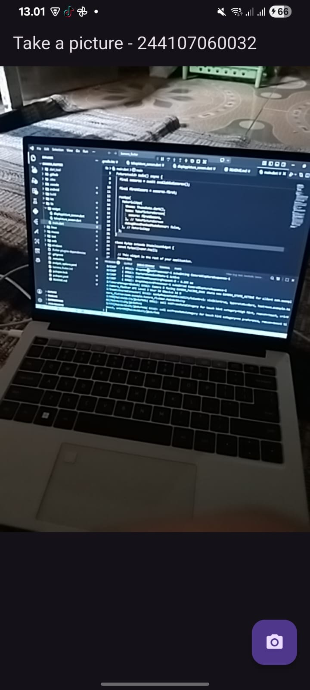
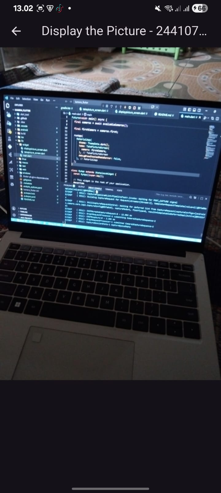

# Laporan Praktikum 09 : Kamera

Nama  : Muhammad Farras Awaludin Alwi  
NIM   : 244107060032  
Absen : 12  

---

## Praktikum 1 : Mengambil Foto dengan Kamera di Flutter

**Langkah 1**  
Buatlah sebuah project Flutter baru dengan nama `kamera_flutter`.

---

**Langkah 2**  
Tambahkan dependensi yang diperlukan pada project Flutter.

Pada praktikum ini terdapat tiga dependensi yang digunakan, yaitu `camera`, `path_provider`, dan `path`.

```bash
flutter pub add camera path_provider path
```

Fungsi dari masing-masing dependensi adalah sebagai berikut.

```text
camera        : digunakan untuk mengakses dan mengontrol kamera pada device
path_provider : digunakan untuk mendapatkan lokasi penyimpanan file pada device
path          : digunakan untuk mengatur path file agar mendukung berbagai platform
```

Jika proses berhasil, maka dependensi akan muncul pada file `pubspec.yaml` di bagian `dependencies`.

Contoh isi bagian `dependencies` pada file `pubspec.yaml` adalah sebagai berikut.

```yaml
dependencies:
  flutter:
    sdk: flutter
  camera:
  path_provider:
  path:
```

Untuk Android, pastikan nilai `minSdkVersion` pada file Gradle minimal `21`.

```gradle
minSdkVersion 21
```

Pada langkah ini, project sudah memiliki package yang diperlukan untuk mengakses kamera dan mengelola file hasil foto.

---

**Langkah 3**  
Ambil sensor kamera dari device.

Buka file `lib/main.dart`, kemudian ubah fungsi `main()` menjadi fungsi `async`.

Kode ini digunakan untuk memastikan plugin Flutter sudah siap digunakan sebelum aplikasi dijalankan.

```dart
WidgetsFlutterBinding.ensureInitialized();
```

Selanjutnya, ambil daftar kamera yang tersedia pada device menggunakan fungsi `availableCameras()`.

```dart
final cameras = await availableCameras();
```

Kemudian ambil kamera pertama dari daftar kamera yang tersedia.

```dart
final firstCamera = cameras.first;
```

Kode lengkap awal pada file `main.dart` adalah sebagai berikut.

```dart
import 'package:camera/camera.dart';
import 'package:flutter/material.dart';
import 'widget/takepicture_screen.dart';

Future<void> main() async {
  WidgetsFlutterBinding.ensureInitialized();

  final cameras = await availableCameras();

  final firstCamera = cameras.first;

  runApp(
    MaterialApp(
      theme: ThemeData.dark(),
      home: TakePictureScreen(
        camera: firstCamera,
      ),
      debugShowCheckedModeBanner: false,
    ),
  );
}
```

Pada langkah ini, aplikasi sudah dapat mendeteksi kamera yang tersedia pada perangkat.

---

**Langkah 4**  
Buat dan inisialisasi `CameraController`.

Buat folder baru bernama `widget` di dalam folder `lib`.

Kemudian buat file baru dengan nama `takepicture_screen.dart`.

Struktur folder project menjadi seperti berikut.

```text
kamera_flutter
├── lib
│   ├── main.dart
│   └── widget
│       └── takepicture_screen.dart
├── pubspec.yaml
```

Isi file `lib/widget/takepicture_screen.dart` dengan kode berikut.

```dart
import 'package:camera/camera.dart';
import 'package:flutter/material.dart';

class TakePictureScreen extends StatefulWidget {
  const TakePictureScreen({
    super.key,
    required this.camera,
  });

  final CameraDescription camera;

  @override
  TakePictureScreenState createState() => TakePictureScreenState();
}

class TakePictureScreenState extends State<TakePictureScreen> {
  late CameraController _controller;
  late Future<void> _initializeControllerFuture;

  @override
  void initState() {
    super.initState();

    _controller = CameraController(
      widget.camera,
      ResolutionPreset.medium,
    );

    _initializeControllerFuture = _controller.initialize();
  }

  @override
  void dispose() {
    _controller.dispose();
    super.dispose();
  }

  @override
  Widget build(BuildContext context) {
    return Container();
  }
}
```

Pada kode tersebut, dibuat class `TakePictureScreen` sebagai halaman untuk mengambil gambar menggunakan kamera.

Variabel `_controller` digunakan untuk menyimpan objek `CameraController`. Controller ini berfungsi untuk menghubungkan aplikasi dengan kamera device.

Variabel `_initializeControllerFuture` digunakan untuk menyimpan proses inisialisasi kamera. Karena proses inisialisasi kamera berjalan secara asynchronous, maka digunakan tipe data `Future<void>`.

Method `initState()` digunakan untuk membuat dan menginisialisasi `CameraController` saat halaman pertama kali dibuat.

Method `dispose()` digunakan untuk menghapus controller ketika halaman tidak digunakan lagi. Hal ini penting agar resource kamera tidak terus berjalan di background.

---

**Langkah 5**  
Gunakan `CameraPreview` untuk menampilkan preview kamera.

Masih pada file `takepicture_screen.dart`, ubah bagian method `build()` menjadi seperti berikut.

```dart
@override
Widget build(BuildContext context) {
  return Scaffold(
    appBar: AppBar(
      title: const Text('Take a picture - 244107060032'),
    ),
    body: FutureBuilder<void>(
      future: _initializeControllerFuture,
      builder: (context, snapshot) {
        if (snapshot.connectionState == ConnectionState.done) {
          return CameraPreview(_controller);
        } else {
          return const Center(
            child: CircularProgressIndicator(),
          );
        }
      },
    ),
  );
}
```

Pada kode tersebut, `FutureBuilder` digunakan untuk menunggu proses inisialisasi kamera selesai.

Jika proses inisialisasi sudah selesai, maka aplikasi akan menampilkan preview kamera menggunakan widget `CameraPreview`.

```dart
return CameraPreview(_controller);
```

Jika proses inisialisasi belum selesai, maka aplikasi akan menampilkan loading menggunakan `CircularProgressIndicator`.

```dart
return const Center(
  child: CircularProgressIndicator(),
);
```

Dengan demikian, preview kamera hanya akan ditampilkan setelah kamera benar-benar siap digunakan.

---

**Langkah 6**  
Ambil foto menggunakan `CameraController`.

Tambahkan `FloatingActionButton` pada bagian `Scaffold` setelah field `body`.

Kode method `build()` menjadi seperti berikut.

```dart
@override
Widget build(BuildContext context) {
  return Scaffold(
    appBar: AppBar(
      title: const Text('Take a picture - 244107060032'),
    ),
    body: FutureBuilder<void>(
      future: _initializeControllerFuture,
      builder: (context, snapshot) {
        if (snapshot.connectionState == ConnectionState.done) {
          return CameraPreview(_controller);
        } else {
          return const Center(
            child: CircularProgressIndicator(),
          );
        }
      },
    ),
    floatingActionButton: FloatingActionButton(
      onPressed: () async {
        try {
          await _initializeControllerFuture;

          final image = await _controller.takePicture();
        } catch (e) {
          print(e);
        }
      },
      child: const Icon(Icons.camera_alt),
    ),
  );
}
```

Pada kode tersebut, `FloatingActionButton` digunakan sebagai tombol untuk mengambil foto.

Ketika tombol ditekan, program akan memastikan kamera sudah selesai diinisialisasi dengan kode berikut.

```dart
await _initializeControllerFuture;
```

Setelah itu, kamera mengambil gambar menggunakan method `takePicture()`.

```dart
final image = await _controller.takePicture();
```

Proses pengambilan gambar dibungkus menggunakan blok `try-catch` untuk menangani error jika terjadi masalah saat kamera digunakan.

Pada langkah ini, aplikasi sudah dapat mengambil foto, tetapi hasil foto belum ditampilkan pada halaman baru.

---

**Langkah 7**  
Buat widget baru `DisplayPictureScreen`.

Buat file baru pada folder `widget` dengan nama `displaypicture_screen.dart`.

Struktur folder project menjadi seperti berikut.

```text
kamera_flutter
├── lib
│   ├── main.dart
│   └── widget
│       ├── takepicture_screen.dart
│       └── displaypicture_screen.dart
├── pubspec.yaml
```

Isi file `lib/widget/displaypicture_screen.dart` dengan kode berikut.

```dart
import 'dart:io';

import 'package:flutter/material.dart';

class DisplayPictureScreen extends StatelessWidget {
  final String imagePath;

  const DisplayPictureScreen({
    super.key,
    required this.imagePath,
  });

  @override
  Widget build(BuildContext context) {
    return Scaffold(
      appBar: AppBar(
        title: const Text('Display the Picture - 244107060032'),
      ),
      body: Image.file(
        File(imagePath),
      ),
    );
  }
}
```

Pada kode tersebut, dibuat class `DisplayPictureScreen` yang digunakan untuk menampilkan hasil foto.

Variabel `imagePath` digunakan untuk menyimpan lokasi file gambar yang telah diambil oleh kamera.

Widget `Image.file` digunakan untuk menampilkan gambar dari file yang tersimpan pada device.

```dart
Image.file(
  File(imagePath),
)
```

Agar `File` dapat digunakan, perlu menambahkan import berikut.

```dart
import 'dart:io';
```

---

**Langkah 8**  
Edit file `main.dart`.

Pada file `main.dart`, bagian `runApp()` diubah agar aplikasi langsung membuka halaman `TakePictureScreen`.

Kode lengkap file `main.dart` adalah sebagai berikut.

```dart
import 'package:camera/camera.dart';
import 'package:flutter/material.dart';
import 'widget/takepicture_screen.dart';

Future<void> main() async {
  WidgetsFlutterBinding.ensureInitialized();

  final cameras = await availableCameras();

  final firstCamera = cameras.first;

  runApp(
    MaterialApp(
      theme: ThemeData.dark(),
      home: TakePictureScreen(
        camera: firstCamera,
      ),
      debugShowCheckedModeBanner: false,
    ),
  );
}
```

Pada kode tersebut, `ThemeData.dark()` digunakan untuk memberikan tema gelap pada aplikasi.

```dart
theme: ThemeData.dark(),
```

Properti `home` digunakan untuk menentukan halaman pertama yang ditampilkan, yaitu `TakePictureScreen`.

```dart
home: TakePictureScreen(
  camera: firstCamera,
),
```

Kamera pertama yang sebelumnya sudah didapatkan dikirim ke halaman `TakePictureScreen` melalui parameter `camera`.

---

**Langkah 9**  
Menampilkan hasil foto.

Agar hasil foto dapat ditampilkan, tambahkan import file `displaypicture_screen.dart` pada file `takepicture_screen.dart`.

```dart
import 'displaypicture_screen.dart';
```

Kemudian ubah isi `onPressed` pada `FloatingActionButton` menjadi seperti berikut.

```dart
onPressed: () async {
  try {
    await _initializeControllerFuture;

    final image = await _controller.takePicture();

    if (!context.mounted) return;

    await Navigator.of(context).push(
      MaterialPageRoute(
        builder: (context) => DisplayPictureScreen(
          imagePath: image.path,
        ),
      ),
    );
  } catch (e) {
    print(e);
  }
},
```

Pada kode tersebut, setelah foto berhasil diambil, hasil foto disimpan ke dalam variabel `image`.

```dart
final image = await _controller.takePicture();
```

Kemudian dilakukan pengecekan `context.mounted`.

```dart
if (!context.mounted) return;
```

Pengecekan ini digunakan untuk memastikan widget masih aktif sebelum melakukan navigasi ke halaman lain.

Setelah itu, aplikasi berpindah ke halaman `DisplayPictureScreen` menggunakan `Navigator`.

```dart
await Navigator.of(context).push(
  MaterialPageRoute(
    builder: (context) => DisplayPictureScreen(
      imagePath: image.path,
    ),
  ),
);
```

Path gambar dikirim ke halaman `DisplayPictureScreen` melalui parameter `imagePath`.

Dengan demikian, setelah pengguna menekan tombol kamera, aplikasi akan mengambil foto dan menampilkan hasil foto pada halaman baru.


---

### Output Praktikum

Setelah aplikasi dijalankan pada device atau smartphone, aplikasi akan menampilkan preview kamera.

Output preview kamera:



Ketika tombol kamera ditekan, aplikasi akan mengambil foto dan menampilkan hasil foto pada halaman baru.

Output hasil foto:



---

### Penjelasan

Pada praktikum ini, saya mempelajari cara menggunakan kamera pada aplikasi Flutter.

Project dibuat dengan nama `kamera_flutter`. Setelah itu, ditambahkan beberapa dependensi yang dibutuhkan, yaitu `camera`, `path_provider`, dan `path`.

Package `camera` digunakan untuk mengakses kamera pada device. Package `path_provider` digunakan untuk mendapatkan lokasi penyimpanan file pada device. Package `path` digunakan untuk membantu pengaturan path agar dapat mendukung berbagai platform.

Pada file `main.dart`, fungsi `main()` dibuat menjadi asynchronous dengan menggunakan `Future<void> main() async`. Hal ini dilakukan karena aplikasi perlu mengambil daftar kamera yang tersedia sebelum `runApp()` dijalankan.

Kode `WidgetsFlutterBinding.ensureInitialized()` digunakan agar plugin Flutter sudah siap digunakan sebelum memanggil fungsi `availableCameras()`.

Setelah daftar kamera diperoleh, kamera pertama disimpan ke dalam variabel `firstCamera`, kemudian dikirim ke halaman `TakePictureScreen`.

Pada halaman `TakePictureScreen`, dibuat `CameraController` untuk mengontrol kamera. Controller tersebut diinisialisasi pada method `initState()` dan dihapus pada method `dispose()`.

Untuk menampilkan preview kamera, digunakan widget `CameraPreview`. Karena proses inisialisasi kamera berjalan secara asynchronous, maka digunakan `FutureBuilder` untuk menunggu kamera siap digunakan. Jika kamera sudah siap, preview kamera akan ditampilkan. Jika belum siap, aplikasi akan menampilkan loading.

Pada bagian bawah layar ditambahkan `FloatingActionButton` dengan ikon kamera. Tombol ini digunakan untuk mengambil foto menggunakan method `takePicture()` dari `CameraController`.

Setelah foto berhasil diambil, aplikasi berpindah ke halaman `DisplayPictureScreen`. Halaman ini menerima path gambar melalui parameter `imagePath`, kemudian menampilkan gambar menggunakan widget `Image.file`.

Dengan demikian, Praktikum 1 berhasil membuat aplikasi Flutter yang dapat mengakses kamera, menampilkan preview kamera, mengambil foto, dan menampilkan hasil foto pada halaman baru.

---

### Kesimpulan

Pada Praktikum 1 Jobsheet 9 ini, saya berhasil membuat aplikasi kamera sederhana menggunakan Flutter.

Aplikasi ini dapat mengambil daftar kamera pada device, memilih kamera pertama, menampilkan preview kamera, mengambil foto, dan menampilkan hasil foto.

Plugin utama yang digunakan adalah `camera`, sedangkan `path_provider` dan `path` digunakan untuk mendukung pengelolaan lokasi file pada berbagai platform.

Dengan praktikum ini, saya memahami cara kerja dasar kamera di Flutter, mulai dari inisialisasi kamera menggunakan `CameraController`, menampilkan preview dengan `CameraPreview`, mengambil foto dengan `takePicture()`, hingga menampilkan hasil foto menggunakan `Image.file`.